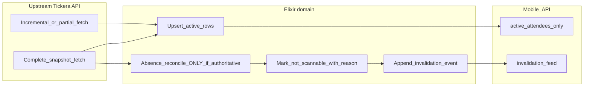

# Authoritative attendee reconciliation and scanner invalidation (backend)

## Plan metadata

- **Plan ID**: `attendee-reconciliation-and-invalidation`
- **Plan version**: `v8`
- **Status**: `draft` (direction approved; implement in phased order below)
- **Scope**: Phoenix import reconciliation, attendee eligibility domain, `/api/v1/mobile/attendees` contract extension, coordination with Android invalidation consumer
- **Last updated**: `2026-04-12`

### Revision log

- `v1` — Initial backend plan (authoritative snapshot gate, soft revoke, invalidation feed, mobile contract).
- `v2` — Rebaselined after sync with `origin/main` (2026-04-12): confirmed codebase assumptions; governance path; device_session vs attendee clarification.
- `v3` — After stakeholder review: **v1 eligibility simplified** to `active` / `not_scannable` + reason; **locked append-only invalidation events table**; **explicit event-scoped sync version** for cursors (do not rely on `updated_at` alone long-term); **phased rollout** (backend → mobile API → Android); guardrails consolidated.
- `v4` — [Scanner sync resilience plan](scanner-sync-resilience_43fe256c.plan.md) marked **implemented (frozen)**; it is **historical reference only** — **do not** expect further implementation from edits to that file. **Phase 3 Android** invalidation consumer and all **new** work: track here + Beads only.
- `v5` — Stakeholder verdict encoded: **future implementation contract** (aligned + accurate baseline) **without** pretending the repo already ships this; explicit **not-yet-implemented** checklist; **implementation discipline** note — [`FastCheck.Events.Sync`](../../lib/fastcheck/events/sync.ex) is procedural today; extract boundaries so reconciliation does not become a `sync.ex` monolith.
- `v6` — **Single implementation contract:** all required code/docs/tests/rollout items consolidated in **§9 Implementation inventory** below. Implement **only** from this plan + Beads; do not scatter checklists across other `.plan.md` files.
- `v7` — **Pinned implementation rules:** `event_sync_version` bumps **once per committing transaction** (batch), not per row; **reactivation v1** = no stream event, active payload + bump only; **Phase 2** = single endpoint, one atomic JSON shape; **admission** = distinct business outcome for `not_scannable` (audit/support); **PR discipline** = Phase 1 PR → Phase 2 PR → Phase 3 PR only.
- `v8` — **Execution risks:** combined-pull pagination semantics **pinned** (attendee `next_cursor` vs invalidation checkpoint — no hand-waving); **`create_bulk`** hazard called out with explicit exclusion expectations; **admission path exhaustiveness** as explicit audit gate; **§9 single checklist** declared **non-negotiable** (do not weaken or fork).

### Nature of this document (verdict)

| Question | Answer |
|----------|--------|
| Aligned as a **future** implementation contract? | **Yes** |
| Accurate about **today’s** backend baseline? | **Yes** |
| Pretending the repo **already** does this? | **No** — this is a **target**. |

The sections below name **current** behavior vs **future** work explicitly so a coding agent does not confuse baseline with shipped features.

### Authority

- **Sole implementation checklist** for this workstream: **§9** in this file. Other planning documents are **non-authoritative** for what to build here (may provide background only). **Do not weaken, split, or duplicate** this checklist across other files — it exists to prevent plan sprawl and agent drift; new scope belongs **here** (with version bump), not in parallel ad-hoc lists.
- **Active contract** for **backend** reconciliation + mobile invalidation API + **follow-on Android invalidation consumer**: **this file**.
- **Historical context:** [`.cursor/plans/scanner-sync-resilience_43fe256c.plan.md`](scanner-sync-resilience_43fe256c.plan.md) describes **shipped** scanner resilience (readiness, orchestration, full-reconcile until tombstones). It is **not** an active backlog document; **conflict rule** for forward work: **this** plan + Beads win.
- **Historical**: Any copy of this plan outside the repo is non-canonical; **this repository path wins**.

### Approved direction (summary)

- Soft revoke, not hard delete by default.
- Revoke by absence **only** after a **proven complete authoritative** snapshot.
- Explicit eligibility in Elixir; explicit invalidation feed to scanners (not inference from “missing row”).
- Clear separation: **upstream import truth** → **Elixir domain truth** → **scanner cache truth**.

## Non-negotiables

1. Do not use “missing from latest import ⇒ hard delete” as the default. Prefer **durable rows + explicit not-scannable state + audit metadata**.
2. **Never** revoke by absence unless the run proves a **complete authoritative snapshot**. Partial pagination, fallbacks, or incremental runs **must not** mass-revoke.
3. Keep layers explicit: upstream import → Elixir eligibility → scanner cache (upserts + **explicit** invalidations).
4. Do **not** use WordPress/Tickera **incremental** sync to perform absence reconciliation unless you have **independent, strong completeness guarantees** (default: **don’t** — incremental stays add/update only).
5. **§9 remains the only implementation checklist** for this workstream — do not fork scope into parallel docs or ad-hoc TODO lists (see Authority).

## What to avoid

- Hard delete on upstream absence.
- Revocation from partial or uncertain fetches.
- Mixing **import/reconciliation** logic and **mobile JSON contract** assembly in one undifferentiated function/module — separate concerns for testability and safety.
- Over-growing the **primary** eligibility enum in v1 — use binary scanner-facing eligibility + reasons (below).

## Current baseline (reverified 2026-04-12)

- **Import**: [`FastCheck.Events.Sync`](../../lib/fastcheck/events/sync.ex) — `sync_event/3` → `TickeraClient.fetch_all_attendees/4` → `Attendees.create_bulk/3`. **No** absence reconciliation.
- **Incremental**: [`incremental_attendees_for_sync/3`](../../lib/fastcheck/events/sync.ex) — new/changed only; **no** removals.
- **Bulk upsert**: [`Attendees.create_bulk/3`](../../lib/fastcheck/attendees.ex) — `on_conflict` on `[:event_id, :ticket_code]`; extend deliberately for new columns.
- **Mobile sync down**: [`FastCheckWeb.Mobile.SyncController`](../../lib/fastcheck_web/controllers/mobile/sync_controller.ex) — `since` + cursor on **`updated_at`** today; **no** eligibility filter; **no** invalidations.
- **Schema**: [`Attendee`](../../lib/fastcheck/attendees/attendee.ex) — no eligibility fields yet.

**Unrelated:** `device_sessions.revoked_at` is **device session** revocation, not ticket eligibility — keep separate.

### Not in the repo yet (explicit — do not assume shipped)

Until implemented, **none** of the following exists in production code paths; the plan describes **work to add**:

- Eligibility / `active` | `not_scannable` fields on attendees
- Append-only **invalidation events** table and writers
- **Snapshot mode** (`complete_authoritative` vs partial/incremental) on the sync run
- **Absence reconciliation** after a complete snapshot
- Mobile **invalidation feed** on `GET` (or companion) under `/api/v1/mobile/`
- **`event_sync_version`** (or equivalent monotonic per-event cursor)

**Honesty on mobile today:** [`since` + cursor over `updated_at`](../../lib/fastcheck_web/controllers/mobile/sync_controller.ex) is the **live** contract; the plan treats moving past `updated_at`-alone as **target** behavior (Phase 2), not current truth.

## Target architecture

## 1) Domain model — v1 simplicity

**Primary scanner-facing eligibility (small enum):**

- `active` — may appear in mobile “active attendees” feed.
- `not_scannable` — must not be admitted from cache; row retained.

**Reason / detail (separate field, stable codes),** e.g.:

- `refunded`
- `revoked`
- `source_missing_from_authoritative_sync`
- `superseded`

Rationale: one binary gate for branching; richer taxonomy without exploding the primary enum. You can add DB constraints or enums on `reason` later without changing the two-state gate.

**Audit / trace (on `attendees` or adjacent):** `revoked_at` (or `ineligible_since`), `source_last_seen_at`, `source_sync_run_id`; optional `superseded_by_attendee_id`.

**Reactivation (v1 — decided):** When a ticket reappears in a later **complete** snapshot, transition row to **`active`**, clear ineligible metadata. **Do not** append a “reactivation” row to the invalidation stream in v1 — the stream is **negative transitions only** (`not_scannable` / tombstones). Clients observe reactivation via **(a)** the attendee reappearing in the **`active` attendees** feed (Phase 2) and **(b)** a higher **`event_sync_version`** after the sync transaction commits. Simpler contract, fewer stream edge cases.

**create_bulk:** keep reconciliation/eligibility mutations **separate** from blind bulk replace where needed so audit fields are not wiped accidentally.

### `event_sync_version` bump rules (pinned — implement exactly this)

**Increment:** **`events.event_sync_version` increases by exactly `1` per committed `Repo.transaction` (or equivalent) that changes **any** mobile-export-visible state for that event — **not** once per changed row.

**Rationale:** N rows updated in one transaction → **one** bump. Avoids noisy cursors and N-times-increment for a single sync pass.

**What qualifies as mobile-visible change (any one in a txn triggers the single bump at end of txn):**

- New **`active`** attendee row (insert) that would appear in mobile active payload.
- Update to an **`active`** attendee that changes **any field included in the mobile serialized attendee** (Phase 2 contract).
- Transition **`active` → `not_scannable`** (includes append to `attendee_invalidation_events` in the same txn when applicable).
- **Reactivation `not_scannable` → `active`** (no invalidation stream row in v1; bump still applies so clients observe new version).

**What does not get its own bump:** individual rows inside a multi-row batch — the **batch transaction** commits once → **one** bump.

**Document in code** next to the bump helper (e.g. `Events.bump_event_sync_version!/1` or inside the transaction callback) so agents do not reintroduce per-row increments.

## 2) Invalidation storage — decision for v1

**Use an append-only `attendee_invalidation_events` table** (name TBD), written when eligibility transitions to **`not_scannable`** (negative transitions). **v1:** no rows for reactivation — see §1.

**Rationale:** easier cursoring and replay, stronger audit trail, clearer Android semantics, avoids deriving tombstones solely from `attendees.updated_at` ordering.

State on `attendees` still holds current eligibility; the append-only stream is the **export** and **history** source for mobile and support.

## 3) Authoritative reconciliation (import job)

Classify each run:

- **`complete_authoritative`**: Full pagination succeeded (`{:ok, _, _}` from `fetch_all_attendees`), no partial-cache fallback, plus any extra completeness checks you add later.
- **`partial_or_incremental`**: Incremental sync, failed fetch, timeout fallback, or ambiguity.

| Mode | Upsert | Absence-based not_scannable |
|------|--------|-----------------------------|
| Complete authoritative | Yes | **Yes** — reason e.g. `source_missing_from_authoritative_sync` + append invalidation event |
| Partial / incremental | Yes (subset) | **No** |

**Normalization:** single canonical `ticket_code` normalization for import + set diff.

**Touchpoint:** [`FastCheck.Events.Sync`](../../lib/fastcheck/events/sync.ex) — reconcile only after successful **complete** fetch; on `{:error, _, partial}`, **no** absence pass.

**Separation:** reconciliation functions live in **Attendees** (or dedicated module); **Sync** orchestrates and passes `sync_run_id` / snapshot mode — do not stuff JSON shapes into sync.

**Implementation discipline (repo reality):** Today’s sync path is **procedural and centralized** in `FastCheck.Events.Sync`. The plan’s boundaries are **right** (orchestration vs domain vs JSON), but the **codebase style** does not yet enforce them. During implementation, **do not** bolt reconciliation, invalidation writes, and mobile concerns into a single growing `sync.ex`. Prefer **new modules** under `FastCheck.Attendees.*` (or `FastCheck.Events.SyncReconciliation` / similar) with **thin** call sites from `sync_event`, plus tests on the extracted functions — same “firm hand” as the separation between import and `SyncController`.

### Admission outcomes (`not_scannable`) — backend

**Requirement:** Every **admission / check-in** path that resolves `ticket_code` → attendee must surface a **distinct business outcome** for `not_scannable` rows:

- **Not** the same as “unknown / not found” (wrong ticket).
- **Not** a single undifferentiated “invalid” unless the response includes a **stable, machine-readable sub-reason** (e.g. tuple tag, `reason_code`) that identifies **ineligibility** vs other failures.

**Why:** support, audit logs, and operator UI must distinguish **revoked / removed / refunded** ticket state from **never existed** and from **transient** errors. Add ExUnit assertions that prove the distinction.

**Exhaustiveness (execution risk):** One missed admission path is enough to **reintroduce green-path scanning** for `not_scannable` attendees. Implementation must **audit the codebase** (grep/code search for `ticket_code`, `fetch_attendee`, `get_attendee`, `check_in`, browser/LiveView scanner routes, API controllers) and produce a **written list** in the PR description of every path checked — **no** “we got the main one.”

## 4) Mobile API — Phase 2 (contract extension)

**Endpoint decision (v1 — no ambiguity):** Extend **only** existing **`GET /api/v1/mobile/attendees`**. **No** companion `GET` for invalidations in v1 — one round-trip, one atomic response.

**Request params (Phase 2 — extend existing):** keep `limit`, `since`, `cursor` for **attendees** as applicable; add **`since_invalidation_id`** (integer, default `0`) — client sends last **`invalidations_checkpoint`** from prior response.

**Atomic response body** (`data` object), minimum fields:

| Field | Role |
|-------|------|
| `attendees` | Array of serialized **active** attendees only (not `not_scannable`). |
| `invalidations` | Array of invalidation events with `id > since_invalidation_id` (stable sort by `id` asc), **capped** per response (share or split `limit` — document explicitly). |
| `event_sync_version` | Current monotonic version for this event **after** this response’s generation (client stores as checkpoint). |
| `server_time` | As today (ISO8601). |
| `next_cursor` | **Attendee stream only** — opaque cursor for the next page of **`active`** attendees (same stable order as today: `updated_at`, `id`). **Does not** encode invalidation position. |
| `invalidations_checkpoint` (or equivalent name) | **Required in v1** — max invalidation `id` included in `invalidations` (client passes as next `since_invalidation_id`). |
| `sync_type`, `count` | Preserve or align with existing client expectations; document deltas. |

**Combined pull semantics (no hand-waving — implement and test explicitly):**

- **Two parallel checkpoints** in one atomic JSON (recommended v1): **`next_cursor`** advances **only** the **attendees** sub-stream; **`invalidations_checkpoint`** (plus request param **`since_invalidation_id`**) advances the **invalidations** sub-stream. **`event_sync_version`** is the global “something changed” counter; clients store it after a successful apply.
- **Do not** use a single `next_cursor` that mixes both feeds **unless** you implement a **fully specified** opaque token, unit tests for encode/decode, and the same documentation obligation — **default for v1** is **separate** `next_cursor` (attendees) + `since_invalidation_id` / `invalidations_checkpoint` to avoid mixed-semantics bugs.
- **Documentation obligation:** `docs/mobile_runtime_truth.md` must describe the **exact** client loop (e.g. drain invalidations with repeated calls while holding attendee cursor, or drain attendees while advancing `since_invalidation_id` — **pick one ordering rule** and test edge cases: large invalidation backlog + empty attendee page, etc.).
- **Tests:** controller tests must cover interleaving / backlog scenarios — not only the happy single-page path.

**Cursor / version:** Clients advance on **`event_sync_version`** plus the two sub-checkpoints above. **Do not** rely on **`updated_at` alone** as the long-term boundary — legacy `since` may exist only as **documented transition** if needed.

**Governance:** intentional `/api/v1/mobile/*` change — document, pair Android DTOs, optional `min_contract_version`.

**Separation:** controller or dedicated view module assembles JSON; **no** inline import rules.

## 5) Android — Phase 3

- Apply attendee upserts for active feed.
- Apply invalidation events explicitly (delete row or mark not scannable locally).
- **Stop inferring** removals from “row not in incremental page.”

Shipped scanner behavior (readiness, orchestration, offline) is described in the **frozen** [scanner-sync-resilience](scanner-sync-resilience_43fe256c.plan.md); Phase 3 here adds **invalidation application** on top once the API exists — implement under **this** plan, not by revising the frozen file.

## 6) Phased rollout (mandatory order)

| Phase | Deliver | Purpose |
|-------|---------|---------|
| **1** | Eligibility + revoke metadata + authoritative snapshot mode + reconcile-by-absence only on complete snapshot + **append invalidation rows** on transition to `not_scannable` | Safe domain foundation without yet changing mobile contract |
| **2** | Mobile API: active attendees only + invalidation feed + **event_sync_version** / cursor semantics | Explicit scanner semantics + replay-safe cursors |
| **3** | Android consumer: upserts + apply invalidations | Field correctness end-to-end |

Do **not** ship Phase 3 before Phase 2 contract is stable enough to implement against.

### PR / merge discipline (strict)

To avoid cross-layer shortcuts:

1. **Phase 1 = its own PR(s)** merged first — DB, domain, sync wiring, admission behavior, server tests. **No** Android changes in this PR.
2. **Phase 2 = its own PR** — `GET /api/v1/mobile/attendees` contract + docs + controller tests. **No** Android app changes in this PR.
3. **Phase 3 = its own PR** — Android consumer only, against **frozen** Phase 2 API.

Do **not** combine Phase 1 + 2 + 3 in a single PR for this workstream.

## 7) Tests

- Phase 1: complete snapshot diff, partial fetch no mass revoke, incremental no absence pass, invalidation rows appended.
- Phase 2: cursor monotonicity across attendee + invalidation interleaving; invalidation-only pages.
- Phase 3: client applies events (covered in Android plan / integration).

## 8) Tracking

Use **Beads** (`bd`) per slice (phase-aligned); no broad `TODO` tracking in code.

## Success criteria

- Upstream removes a ticket → after **complete** sync, domain marks `not_scannable` with reason → invalidation row exists → Phase 2 mobile exposes it → Phase 3 scanners drop stale positives.
- No mass false revoke on partial or incremental runs.

---

## 9) Implementation inventory (complete change list — use this alone)

**Rule:** Every deliverable for attendee reconciliation + invalidation is listed below. **Do not** rely on other `.plan.md` files for implementation scope. Update **this section** if scope changes (then bump plan version + revision log).

### Execution risks (not plan flaws — discipline during coding)

| Risk | Mitigation (already in this plan) |
|------|-----------------------------------|
| **Combined response pagination** | §4 + Phase 2 §9: two checkpoints (`next_cursor` attendees + `since_invalidation_id` / `invalidations_checkpoint`); document full client loop; tests for backlog + paging edges — **no** vague “we’ll figure out cursor later.” |
| **`create_bulk/3` wiping domain** | Explicit `replace_all_except` expansion + regression test that eligibility/audit survive sync-shaped upserts. |
| **Missed admission path** | Exhaustive grep + enumerated PR list; distinct `not_scannable` outcome everywhere. |

### Phase 1 — Database (Ecto migrations)

- [ ] **`attendees` table:** add columns (exact names implementer may finalize; semantics required):
  - `scan_eligibility` (or `eligibility_status`): `active` \| `not_scannable` — default `active` for backfill
  - `ineligibility_reason` (nullable string or enum): codes such as `refunded`, `revoked`, `source_missing_from_authoritative_sync`, `superseded`
  - `ineligible_since` / `revoked_at` (utc_datetime, nullable)
  - `source_last_seen_at` (utc_datetime, nullable)
  - `last_authoritative_sync_run_id` (uuid or string, nullable) — ties row to last complete snapshot run that saw or reconciled this ticket
  - Optional: `superseded_by_attendee_id` (fk nullable)
- [ ] **`events` table:** add `event_sync_version` (bigint, default 0). **Bump rule:** increment by **1 per committed transaction** that changes mobile-visible state — **not** per row (see §1 `event_sync_version` bump rules). Implement one helper used at end of such transactions.
- [ ] **New table `attendee_invalidation_events`** (append-only): at minimum `id`, `event_id`, `attendee_id`, `ticket_code` (denormalized for stable client key), `change_type`, `reason_code`, `effective_at`, `source_sync_run_id` (nullable), `inserted_at`; indexes for `(event_id, id)` cursor paging and `(event_id, inserted_at)`.
- [ ] **Constraints/indexes:** FKs to `events`, `attendees`; consider unique constraint if idempotency per `(event_id, attendee_id, change_type, effective_at)` is required — define in migration.

### Phase 1 — Schemas and domain modules

- [ ] [`lib/fastcheck/attendees/attendee.ex`](../../lib/fastcheck/attendees/attendee.ex) — schema fields + `changeset/2` for new columns; guard mass-assignment in admin paths if any.
- [ ] **New:** `lib/fastcheck/attendees/attendee_invalidation_event.ex` (or under `ticketing/`) — schema for append-only events.
- [ ] [`lib/fastcheck/events/event.ex`](../../lib/fastcheck/events/event.ex) — `event_sync_version` field.
- [ ] **New:** `lib/fastcheck/attendees/eligibility.ex` or `lib/fastcheck/attendees/reconciliation.ex` — pure/domain functions: normalize `ticket_code`; `reconcile_absent_after_authoritative_snapshot/...`; transition to `not_scannable` + insert invalidation row; **single `event_sync_version` bump per committing transaction** (batch), not per attendee row.
- [ ] [`lib/fastcheck/attendees.ex`](../../lib/fastcheck/attendees.ex) — public API delegating to reconciliation; adjust [`create_bulk/3`](../../lib/fastcheck/attendees.ex) **only** as needed.
- [ ] **`create_bulk` execution hazard:** Current `on_conflict: {:replace_all_except, [...]}` **must** be extended so **Tickera field upserts never wipe** `scan_eligibility`, `ineligibility_reason`, `ineligible_since` / `revoked_at`, `source_last_seen_at`, `last_authoritative_sync_run_id`, or other audit columns — **unless** a dedicated code path intentionally updates them (e.g. reactivation in sync transaction). Add **ExUnit** that bulk upsert from “sync shape” rows leaves a pre-set `not_scannable` row **unchanged** in eligibility fields. Prefer explicit `replace_all_except` list expansion over accidental broad replace.
- [ ] **Optional:** `lib/fastcheck/attendees/reason_codes.ex` — `@moduledoc` + constants for reason strings (no scattered magic strings).

### Phase 1 — Sync orchestration (thin integration)

- [ ] [`lib/fastcheck/events/sync.ex`](../../lib/fastcheck/events/sync.ex) — after successful **`{:ok, _, _}`** from `fetch_all_attendees` **and** `incremental == false`, set snapshot as `complete_authoritative`, generate `sync_run_id`, pass imported ticket code set to reconciliation; **skip** absence reconciliation when `incremental == true` or fetch failed/partial. **Keep calls thin** — no new business logic inline beyond orchestration.
- [ ] On each successful application of upstream rows in full sync, update `source_last_seen_at` (and eligibility reset to `active` when ticket reappears after `not_scannable`).
- [ ] Telemetry/logging: counts for upserted, reconciled-not-scannable, reactivated — **no PII** in logs.

### Phase 1 — Downstream consumers (server-only until Phase 2)

- [ ] **Scan / admission paths (exhaustive):** [`lib/fastcheck/attendees/scan.ex`](../../lib/fastcheck/attendees/scan.ex) and **every** code path that resolves `ticket_code` → attendee for admission (LiveView scanner, portal, controllers, bulk paths). **Distinct business outcome** for `not_scannable` (§3). **Deliverable:** PR must include an **enumerated list** of files/modules verified (grep-driven audit). **Risk:** one forgotten path ⇒ green-path check-in for revoked tickets.
- [ ] **Cache:** [`lib/fastcheck/attendees/cache.ex`](../../lib/fastcheck/attendees/cache.ex) — if cached attendee maps are used for scan path, invalidate or respect eligibility.

### Phase 1 — Tests (ExUnit)

- [ ] [`test/fastcheck/events/sync_test.exs`](../../test/fastcheck/events/sync_test.exs) — full sync triggers reconciliation mock/fixture; incremental does not.
- [ ] **New:** `test/fastcheck/attendees/reconciliation_test.exs` (or similar) — set-diff, reactivation, no revoke on partial simulation.
- [ ] [`test/fastcheck/attendees_bulk_test.exs`](../../test/fastcheck/attendees_bulk_test.exs) — extend if `create_bulk` behavior changes.
- [ ] **Scan tests:** [`test/fastcheck/attendees/scan_test.exs`](../../test/fastcheck/attendees/scan_test.exs) — `not_scannable` denied with correct outcome.

### Phase 2 — Mobile HTTP API + contract

- [ ] [`lib/fastcheck_web/controllers/mobile/sync_controller.ex`](../../lib/fastcheck_web/controllers/mobile/sync_controller.ex) — extend **`get_attendees` only** (§4): parse `since_invalidation_id`; return `invalidations_checkpoint`; single atomic `data` with `attendees`, `invalidations`, `event_sync_version`, `server_time`, `next_cursor`, `sync_type`/`count` — **no** companion route in v1.
- [ ] **Combined pagination:** implement §4 **two-checkpoint** semantics (`next_cursor` = attendees only; invalidations via `since_invalidation_id` / `invalidations_checkpoint`). **No hand-waving** — unit tests for large invalidation backlog + attendee paging edge cases.
- [ ] Document **exact client catch-up loop** and limit-splitting rule in `docs/mobile_runtime_truth.md`.
- [ ] Read `events.event_sync_version` in response; ensure writers use **§1 bump rules** (once per txn).
- [ ] [`lib/fastcheck_web/router.ex`](../../lib/fastcheck_web/router.ex) — **no** new mobile routes for this feature in v1 unless §4 is explicitly revised later.
- [ ] **Fallback / errors:** [`lib/fastcheck_web/controllers/fallback_controller.ex`](../../lib/fastcheck_web/controllers/fallback_controller.ex) — only if new error codes.
- [ ] **Tests:** [`test/fastcheck_web/controllers/mobile/sync_controller_test.exs`](../../test/fastcheck_web/controllers/mobile/sync_controller_test.exs) — pagination, version monotonicity, empty invalidation page, active-only filter.

### Phase 2 — Documentation

- [ ] Update [`docs/mobile_runtime_truth.md`](../../docs/mobile_runtime_truth.md) (or add `docs/mobile_api_attendee_sync.md`) — request/response shapes, `event_sync_version`, migration from `since`+`updated_at`, `min_contract_version` if used.
- [ ] [`AGENTS.md`](../../AGENTS.md) — short pointer under mobile API section if contract section grows.

### Phase 3 — Android scanner app (only after Phase 2 PR merged)

**Do not start** until Phase 2 API is merged and documented — avoids contract drift.

- [ ] [`android/scanner-app/app/src/main/java/za/co/voelgoed/fastcheck/data/remote/RemoteModels.kt`](../../android/scanner-app/app/src/main/java/za/co/voelgoed/fastcheck/data/remote/RemoteModels.kt) — DTOs for `invalidations`, version fields.
- [ ] [`android/scanner-app/app/src/main/java/za/co/voelgoed/fastcheck/core/network/PhoenixMobileApi.kt`](../../android/scanner-app/app/src/main/java/za/co/voelgoed/fastcheck/core/network/PhoenixMobileApi.kt) — query params / response mapping.
- [ ] [`android/scanner-app/.../CurrentPhoenixSyncRepository.kt`](../../android/scanner-app/app/src/main/java/za/co/voelgoed/fastcheck/data/repository/CurrentPhoenixSyncRepository.kt) (or equivalent) — apply invalidations (delete/mark local row); persist cursor/version in [`SyncMetadataEntity`](../../android/scanner-app/app/src/main/java/za/co/voelgoed/fastcheck/data/local/SyncMetadataEntity.kt) or new fields.
- [ ] [`android/scanner-app/docs/sync_algorithm.md`](../../android/scanner-app/docs/sync_algorithm.md) — document invalidation application.
- [ ] Android unit/instrumented tests as appropriate for repository merge behavior.

### Cross-cutting (all phases)

- [ ] **`mix precommit`** / CI green after each phase merge.
- [ ] **Beads:** one or more `bd` items per phase; close with resolution + files changed.
- [ ] **No** `TODO`/`FIXME` for cross-phase work — Beads only (per repo rules).
- [ ] **PR order:** Phase 1 PR → Phase 2 PR → Phase 3 PR only (see §6); no combined mega-PR for this workstream.

### Explicitly out of scope for this plan (unless added here later)

- Editing [`scanner-sync-resilience_43fe256c.plan.md`](scanner-sync-resilience_43fe256c.plan.md) (frozen).
- Device-session / `device_sessions` revocation (different domain).
- Changing Tickera HTTP client semantics beyond what sync orchestration needs.
- Hard-deleting `attendees` rows by absence.
