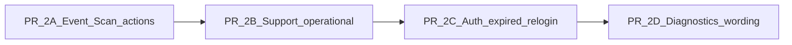

# Priority 2 — Real operator controls (versioned plan)

## Plan metadata

| Field | Value |
|--------|--------|
| **Plan ID** | `priority-2.2-operator-controls` |
| **Plan version** | `v3` |
| **Scope** | [`android/scanner-app/`](android/scanner-app/) only |

**This v3 plan is the execution contract** for agents and implementers (what to build, scope locks, minimum tests). [priority-2.1-authority-current-baseline-and-regression-plan.md](docs/development/priority-2.1-authority-current-baseline-and-regression-plan.md) remains the **long-form** baseline (file paths, extended matrix, Gradle commands). Use 2.1 where this plan does not repeat detail.

---

## Authority model

| Document | Role |
|----------|------|
| [priority-2.1-authority-current-baseline-and-regression-plan.md](docs/development/priority-2.1-authority-current-baseline-and-regression-plan.md) | **Supplementary contract** — full baseline, gaps, rules, extended tests. **If anything conflicts with historical 2.2 markdown, 2.1 wins.** |
| [priority-2.2-historical-real-operator-controls-pr-plan.md](docs/development/priority-2.2-historical-real-operator-controls-pr-plan.md) | **Historical execution detail** — prompts and extra context. **Not** a second authority over this v3 plan. |

Before implementation, align the historical 2.2 doc authority section in the same docs pass, **but this v3 plan is sufficient as the execution contract.** Editing that markdown is **docs-alignment**, not a prerequisite that blocks code work.

---

## What stays (valid)

- **4-PR split:** 2A Event/Scan actions, 2B Support operational recovery, 2C auth-expired re-login, 2D wording/truth locks.
- **Scope:** `android/scanner-app` only; no new backend endpoints, no new diagnostics backend, no token refresh.
- **Starting point:** Event has no action model yet; Scan has retry-upload only as an action; Support actions are still camera/settings/return plus messaging; auth-expired is banner-level until 2C adds CTA; diagnostics data already exists (wording locks in 2D).

---

## Non-negotiables (inlined essentials)

These mirror [priority-2.1-authority-current-baseline-and-regression-plan.md](docs/development/priority-2.1-authority-current-baseline-and-regression-plan.md) §4 — **full list stays in 2.1.**

- Queued scans: recovery must not silently discard them.
- Auth-expired: intervention state, not a hidden retry.
- Manual sync: secondary recovery, not main scan flow.
- Support: operator support, not a dashboard.
- Diagnostics: read-only; no new interactive control surface there.
- Re-login: reuse existing session/login boundary — **no** refresh-token subsystem.
- Event and Scan: urgent recovery stays where the operator already is (do not hide everything behind Support).
- Upload categories stay truthful: offline ≠ auth-expired ≠ retryable ≠ queued-local.

---

## Scope drift locks (strict — do not loosen)

| PR | Relogin | Auth-expired UX |
|----|---------|-----------------|
| **2A** | **Must not** introduce re-login (no enum, CTA, or routing). No `Relogin` “plumbing” in 2A. | Banner-only. |
| **2B** | **Must not** introduce Relogin. | Banner-only. |
| **2C** | **Only PR** that adds `Relogin` and CTAs. | Banner + **Re-login** where rules say so. |
| **2D** | Wording/tests only. | Truth-lock copy. |

---

## PR 2C — Re-login wiring

**Relogin must not route through the generic logout-confirmation UX if that UX implies discard or shutdown.**

Also:

- **Relogin** must preserve **queue** and **local admission overlay** truth on device (same guarantees as the existing queue-aware shell).
- The path must not read as destructive “log out and lose work” when fixing auth-expired — copy and navigation should read as **resume / sign in again to upload**.

Route `onRelogin` through the **exact** existing session path that already preserves queue and overlays, or a thin wrapper with identical guarantees. Add tests that **Relogin** is not wired like generic logout that implies discard.

---

## Minimum required tests by PR (self-contained)

### PR 2A — Event / Scan action visibility

- **Event:** presenter tests for **ManualSync** and **RetryUpload** visibility (show/hide rules: e.g. sync not in flight, backlog meaningful, etc. — align with presenter rules in 2.1 §9 if needed).
- **Scan:** same for **ManualSync** + **RetryUpload**; **regression** that existing Scan **Retry upload** behavior is unchanged.
- **No Relogin** anywhere in 2A; auth-expired stays **banner-only** (no Relogin CTA).

### PR 2B — Support operational action visibility

- Presenter tests: **operational** actions (manual sync, retry upload) appear **only when meaningful** (e.g. no retry when queue empty; manual sync hidden/disabled while sync running — per 2.1 §10).
- **Scanner recovery** vs **Operations** sections stay distinct.
- **No Relogin** in 2B.

### PR 2C — Relogin visibility + queue/overlay preservation

- **Show Relogin** when upload state is auth-expired **and** backlog/queue condition matches rules (e.g. queue &gt; 0 per 2.1 §11).
- **Do not show** Relogin for offline-only, retryable non–auth-expired, or empty queue (inappropriate cases).
- Tests or integration checks that the **Relogin** route preserves **queue** and **overlay** state and does **not** use generic logout-confirmation UX that implies discard/shutdown.

### PR 2D — Wording / truth-lock tests

- **DiagnosticsUiStateFactory** (and support copy as touched): **queued-local**, **offline pause**, **retryable**, and **auth-expired** stay **distinct** in strings/semantics.
- Diagnostics copy does **not** imply direct recovery controls beyond navigation to real surfaces.

---

## Execution order (do not reorder)

**Branches:** Prefer names in [priority-2.1-authority-current-baseline-and-regression-plan.md](docs/development/priority-2.1-authority-current-baseline-and-regression-plan.md) §7 (stacked PRs).

---

## PR summaries (short)

| PR | Deliver |
|----|---------|
| **2A** | Event + Scan: `ManualSync`, `RetryUpload`; no Relogin. |
| **2B** | Support: queue/sync viewmodels; operational section; no Relogin. |
| **2C** | `Relogin` only; visibility + wiring per PR 2C section. |
| **2D** | Wording + truth-lock tests only. |

**Extended file lists and prompts:** [priority-2.1-authority-current-baseline-and-regression-plan.md](docs/development/priority-2.1-authority-current-baseline-and-regression-plan.md) §9–§12.

---

## Deeper reference (optional)

Full regression matrix, Gradle commands, Codex reject list: [priority-2.1-authority-current-baseline-and-regression-plan.md](docs/development/priority-2.1-authority-current-baseline-and-regression-plan.md) §13–§15.

---

## After merge

If enum or path names drift on `main`, reconcile tests; keep historical 2.2 markdown aligned when editing docs.
