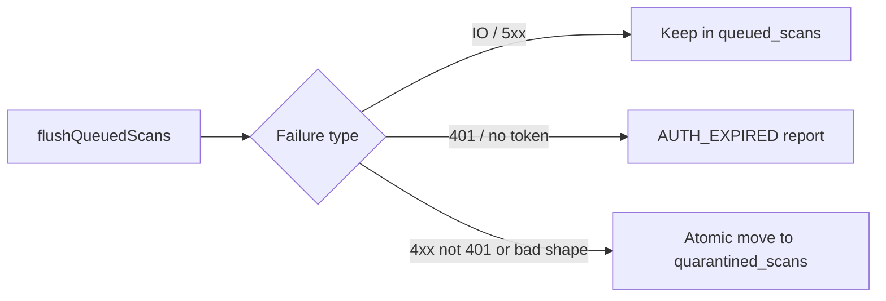

# Priority 3.1 — Poison queue / quarantine execution plan

**Plan version:** v3  
**Last updated:** 2026-04-06  

### Revision log

- **v1** — Initial plan (3A/3B/3C, DLQ alignment, overlay-safe rules, batch attribution).
- **v2** — Explicit `MobileScanRepository` quarantine contract (no “if needed”); hard-coded quarantine eligibility; replay-cache non-falsification; migration test matrix; todos tightened.
- **v3** — Repository read contract **locked to PR 3A** (schema + DAO + `MobileScanRepository` together); PR 3B = flush only, PR 3C = consume only. Added explicit PR 3B tests: 401/missing token, 5xx, `IOException` each keep queue live and **quarantine count unchanged**.

---

## Authority and rebaseline vs history

- **Canonical contract:** [docs/development/priority-3.1-authority-current-baseline-and-regression-plan.md](docs/development/priority-3.1-authority-current-baseline-and-regression-plan.md) — use this for versions, overlay rules, PR split, and acceptance criteria.
- **Historical only:** [docs/development/priority-3.2-historical-poison-queue-handling-pr-plan.md](docs/development/priority-3.2-historical-poison-queue-handling-pr-plan.md) — same intent (DLQ-style containment) but **stale repo facts** (e.g. DB at v6, no overlays). Do not implement from 3.2’s migration numbers.

**Key deltas 3.2 → 3.1:** DB is already **v7** with `local_admission_overlays` and `MIGRATION_6_7`; quarantine lands as **`MIGRATION_7_8`**. Flush logic must respect **overlay truth** (quarantine ≠ success; do not resolve overlays as confirmed just because the queue row moved).

---

## Quarantine eligibility (single authoritative rule set)

**Write this once in implementation; do not broaden without a deliberate contract change.**

Quarantine applies **only** when moving attempted queue rows into `quarantined_scans` is the honest containment action:

| Eligible for quarantine | Rationale |
|-------------------------|-----------|
| `HttpException` with **code < 500** and **code ≠ 401** | Matches current `catch (HttpException)` branch: 4xx other than 401 (repo already routes 401 and 5xx elsewhere). |
| `IllegalArgumentException` | Incomplete/invalid response shape (`requireNotNull` / classifier) — current path that yields `WORKER_FAILURE` without server row classification. |

**Do not quarantine:**

| Keep out of quarantine | Rationale |
|------------------------|-----------|
| **401** | Auth-expired; queue stays live; re-login path. |
| **`IOException`** | Retryable network — current repo bucket. |
| **HTTP ≥ 500** | Retryable server — current repo bucket. |

This mirrors the existing buckets in [`CurrentPhoenixMobileScanRepository.flushQueuedScans`](android/scanner-app/app/src/main/java/za/co/voelgoed/fastcheck/data/repository/CurrentPhoenixMobileScanRepository.kt) (`when` on `HttpException`, `IllegalArgumentException`, `IOException`). Missing/blank token remains **auth-expired**, not quarantine (handled before upload).

---

## Non-falsification rules (overlays + replay cache)

1. **Overlays (unchanged):** Quarantining a queue row must **not** transition a local admission overlay to success, duplicate, or terminal conflict **as if** the server classified the scan. Containment only.

2. **Replay cache (new explicit rule):** Quarantine must **not** write **terminal replay-cache rows** for those scans. Terminal replay cache today exists only for **classified server outcomes** (`upsertReplayCache` after real results). There is **no** row-level server classification in quarantine-eligible failures, so the quarantine path must not invent replay-cache terminal truth.

---

## Repository contract (explicit — locked to PR 3A)

[`MobileScanRepository`](android/scanner-app/app/src/main/java/za/co/voelgoed/fastcheck/data/repository/MobileScanRepository.kt) today exposes queue depth, latest flush report, and two observe methods — **nothing** for quarantine.

**PR 3A delivers the full read contract** alongside schema + DAO:

- **ScannerDao:** quarantine read/observe primitives.
- **`MobileScanRepository` + `CurrentPhoenixMobileScanRepository`:** a **defined** API parallel to existing patterns, for example:
  - `quarantineCount` / `suspend fun quarantineCount(): Int` (or equivalent naming consistent with `pendingQueueDepth()`)
  - `latestQuarantineSummary` / `QuarantineSummary?` (or `Flow<QuarantineSummary?>` if summary is the single read model)
  - `observeQuarantineCount(): Flow<Int>` and/or `observeLatestQuarantineSummary(): Flow<QuarantineSummary?>` as needed for UI collectors

Implementations return **zero / empty** until PR 3B first writes quarantine rows. **PR 3B does not expand or relocate this contract** — it only changes flush behavior. **PR 3C** consumes the **already-established** repository API only — no ad-hoc DAO access from presenters.

This keeps review boundaries clean: **3A = persistence + contract**, **3B = flush**, **3C = UI**.

---

## Industry alignment (web / established patterns)

These map cleanly to the doc’s rules; they are not a different design.

| Pattern | How 3.1 applies |
|--------|------------------|
| **Dead letter queue (DLQ)** | Dedicated `quarantined_scans` table — isolate “poison” payloads from the **hot** retry queue so WorkManager/flush does not spin on non-retryable failures. |
| **Failure classification** | Use the **Quarantine eligibility** table above only; aligns with existing `catch` structure. |
| **No false row-level attribution** | When the API only fails the **batch**, quarantine the **attempted batch** and set `batchAttributed` / `BATCH_ATTRIBUTION_UNAVAILABLE` — do not invent a single bad row. |
| **Audit context** | Store original payload + reason + message + timestamps (+ `overlayStateAtQuarantine` per 3.1). |
| **Atomic move** | Room **`@Transaction`** on DAO: insert quarantine row(s) + delete matching `queued_scans` in one transaction ([Android `Transaction` docs](https://developer.android.com/reference/kotlin/androidx/room/Transaction)). |

---

## Current code anchors (verified)

- **Poison gap:** On quarantine-eligible paths today, flush returns `WORKER_FAILURE` and **leaves rows in the queue** — `HttpException` else branch (non-401, <500) and `IllegalArgumentException` in [`CurrentPhoenixMobileScanRepository.kt`](android/scanner-app/app/src/main/java/za/co/voelgoed/fastcheck/data/repository/CurrentPhoenixMobileScanRepository.kt).
- **Overlay transitions** only from classified server outcomes via `transitionOverlayForFlushOutcome` — quarantine path must not invoke this for fake gate truth.
- **Replay cache** is written only after real `terminalOutcomes` from the classifier — quarantine must not add terminal replay rows for unclassified failures.
- **Migration registration gap (must fix in 3A):** [`DatabaseModule.kt`](android/scanner-app/app/src/main/java/za/co/voelgoed/fastcheck/app/di/DatabaseModule.kt) lists migrations only through `MIGRATION_5_6` while the database is **v7**. Register **`MIGRATION_6_7`** and **`MIGRATION_7_8`**.

---

## Migration testing matrix (explicit)

Reduce ambiguity for reviewers and CI:

| Case | Expectation |
|------|-------------|
| **Upgrade 6 → 7 → 8** | Chain migrations; DB opens; schema consistent. |
| **Upgrade 7 → 8** | Direct path from current main baseline. |
| **`DatabaseModule`** | **Registers** `MIGRATION_6_7` and `MIGRATION_7_8` (verify in test or module test / instrumentation as appropriate for this repo). |
| **Data survival** | Pre-existing **queue** rows (and **overlays** where applicable) **survive** migration; new **quarantine** table exists and is **empty** immediately after migration unless a later test seeds it. |

Use / extend [`FastCheckDatabaseMigrationRetainedQueueTest.kt`](android/scanner-app/app/src/androidTest/java/za/co/voelgoed/fastcheck/core/database/FastCheckDatabaseMigrationRetainedQueueTest.kt), [`FastCheckDatabaseMigrationTest.kt`](android/scanner-app/app/src/test/java/za/co/voelgoed/fastcheck/core/database/FastCheckDatabaseMigrationTest.kt), and siblings as needed so the matrix above is covered, not only “single hop” cases.

---

## PR sequence (merge order fixed)

### PR 3A — Quarantine persistence (`MIGRATION_7_8`, DB v8)

- Add [`QuarantinedScanEntity`](android/scanner-app/app/src/main/java/za/co/voelgoed/fastcheck/data/local/) + [`QuarantineReason.kt` / `QuarantineSummary.kt`](android/scanner-app/app/src/main/java/za/co/voelgoed/fastcheck/domain/model/) per §9–§11 of 3.1 (include `overlayStateAtQuarantine`, `batchAttributed`, indexes on `idempotencyKey`, `eventId+quarantinedAt`, `quarantinedAt`).
- Extend [`ScannerDao`](android/scanner-app/app/src/main/java/za/co/voelgoed/fastcheck/data/local/ScannerDao.kt): insert/count/observe/load latest + **`@Transaction` queue→quarantine move**.
- Update [`FastCheckDatabase.kt`](android/scanner-app/app/src/main/java/za/co/voelgoed/fastcheck/core/database/FastCheckDatabase.kt) + [`FastCheckDatabaseMigrations.kt`](android/scanner-app/app/src/main/java/za/co/voelgoed/fastcheck/core/database/FastCheckDatabaseMigrations.kt); **fix `DatabaseModule` migration list**.
- **Mandatory (same PR):** **`MobileScanRepository` quarantine read/observe methods** and **`CurrentPhoenixMobileScanRepository` implementation** — stable contract for 3C; return **zero / empty** until 3B moves rows.
- Tests: DAO unit tests + **migration matrix** above.
- **Explicit non-goals:** No flush quarantine behavior yet, no UI (per 3.1 §11).

### PR 3B — Flush containment + overlay-safe behavior

- In [`CurrentPhoenixMobileScanRepository.flushQueuedScans`](android/scanner-app/app/src/main/java/za/co/voelgoed/fastcheck/data/repository/CurrentPhoenixMobileScanRepository.kt), on **only** eligibility-table failures: build quarantine rows, snapshot overlay state when needed, **atomic DAO move**; **do not** `upsertReplayCache` for terminal truth for these scans; **do not** call `transitionOverlayForFlushOutcome` for fake outcomes.
- Adjust `FlushReport` / summary strings so a completed flush can state quarantine containment without implying server success (3.1 §12; avoid broad `FlushExecutionStatus` redesign).
- Extend [`CurrentPhoenixMobileScanRepositoryTest.kt`](android/scanner-app/app/src/test/java/za/co/voelgoed/fastcheck/data/repository/CurrentPhoenixMobileScanRepositoryTest.kt):
  - **Quarantine path:** eligibility matrix, batch attribution, overlay non-falsification, **replay cache not written** on quarantine path, queue depth vs quarantine count when rows are quarantined.
  - **Non-quarantine regressions (explicit — prevents accidental broadening):**
    - **401** and **missing/blank token** before upload: **queue stays live**; **quarantine count unchanged**.
    - **HTTP 5xx:** **queue stays live**; **quarantine count unchanged**.
    - **`IOException`:** **queue stays live**; **quarantine count unchanged**.

### PR 3C — Surfacing + regression locks

- **Consume** the **existing** `MobileScanRepository` quarantine methods only — [`QueueUiState` / factories / ViewModel`](android/scanner-app/app/src/main/java/za/co/voelgoed/fastcheck/feature/queue/), [`EventDestination*`](android/scanner-app/app/src/main/java/za/co/voelgoed/fastcheck/feature/event/), [`SupportOverview*`](android/scanner-app/app/src/main/java/za/co/voelgoed/fastcheck/feature/support/), [`DiagnosticsUiStateFactory`](android/scanner-app/app/src/main/java/za/co/voelgoed/fastcheck/feature/diagnostics/DiagnosticsUiStateFactory.kt).
- Calm copy: separate **live backlog** vs **quarantined**; zero-quarantine UI non-noisy; no detail screens/actions (3.1 §13).
- Presenter/factory tests under existing `feature/*` test dirs.

---

## Explicitly out of scope (do not expand)

- Supervisor tooling; quarantine retry/resolution workflows; quarantine detail drill-down UI; backend schema/API changes; Phoenix contract changes.

---

## Docs and process (repo rules)

- **Android-only scope** — no Phoenix schema/API contract changes.
- Per [AGENTS.md](AGENTS.md): run `mix precommit` only if Elixir/docs touched; for Android use the Gradle command in §15 of 3.1 after each PR.
- **Beads:** Before implementation, create/claim a Bead for this workstream and close with resolution notes per workspace workflow (implementation phase, not this planning step).

---

## Success checklist (from 3.1 §16 + plan addenda)

Unrecoverable rows off the live queue; full payload in quarantine; queue depth honest; quarantine visible separately; overlays not falsified; **replay cache not falsified**; batch-level uncertainty explicit; **`MobileScanRepository` quarantine API shipped in 3A** (3B flush-only, 3C consume-only); PR 3B tests include **explicit non-quarantine** cases (401/missing token, 5xx, `IOException` → queue live, quarantine count unchanged); migration matrix verified; no supervisor tooling in this priority.
