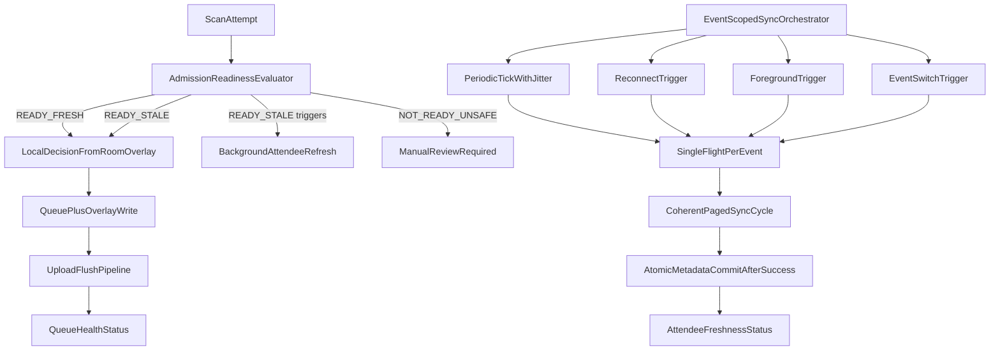

# Android Scanner Sync Resilience Plan

> **Implemented (frozen).** The behavior described here is **shipped**. **Do not treat future edits to this file as implementation backlog.** For ongoing work: server-side invalidation / eligibility / mobile API → [`.cursor/plans/attendee-reconciliation-and-invalidation.plan.md`](attendee-reconciliation-and-invalidation.plan.md); new Android scope → new plan or Beads, not revisions here.

## Plan Metadata

- Plan ID: `scanner-sync-resilience`
- Plan version: `v2.5`
- Status: **`implemented` (frozen — historical reference only)**
- Scope: Android scanner app sync/admission behavior for live event operations (as delivered)
- Last updated: `2026-04-12`

## Authority

- **This file is no longer an active implementation contract.** It records what was built; **changes to this plan will not be implemented.**
- **Active contracts for new work:** [`.cursor/plans/attendee-reconciliation-and-invalidation.plan.md`](attendee-reconciliation-and-invalidation.plan.md) (backend eligibility, invalidation feed, `event_sync_version`, phased API + Android invalidation consumer).
- **Conflict rule:** N/A for forward work — use the attendee reconciliation plan and Beads.

## Revision Log

- `v1` - Initial plan based on event-operations requirements: stale-but-usable cache, periodic auto-sync, connectivity-aware retries, and scan-path non-blocking behavior.
- `v2` - Tightened implementation contract with explicit bootstrap state machine, deterministic scan decision matrix (including missing-ticket handling), strict sync ownership boundaries, foreground sync policy, and concrete timeout/metadata requirements.
- `v2.1` - Final hardening: trigger coalescing rules, explicit periodic jitter bounds, recovery/self-heal for corrupt metadata, full-reconcile fallback triggers (pre-tombstone), multi-device race validation, and distinct operator copy for stale+missing ticket (not generic manual-review bucket).
- `v2.2` - Polish: pinned integrity-failure threshold for full reconcile; explicit corrupt-recovery branches (metadata vs metadata+attendees); full reconcile strategy fixed to atomic event-scoped replace; tunable periodic interval (default not sacred); optional UI copy alternatives; domain reason code for stale+missing.
- `v2.3` - Execution-ready: status `ready`; half-trust guard during metadata-only recovery re-bootstrap; count-based `N` explicitly tunable + anti-fossilization; UI copy discipline (domain reason vs telemetry vs strings); recommended implementation execution order.
- `v2.4` - Linked canonical **backend** plan for invalidation API (`attendee-reconciliation-and-invalidation.plan.md`); clarified authority split (Android vs server contract).
- `v2.5` - **Implemented and frozen:** work complete; file is historical reference only; invalidation/API follow-up tracked solely under attendee reconciliation plan (not via edits here).

## Goal

Make attendee refresh fully automatic and event-scoped while preserving offline-first local scanning. Stale cache must degrade gracefully (warning + background refresh), and manual review must be reserved for genuinely unsafe local state.

## Current Baseline

- Admission blocks to manual review when cache is older than threshold via `hasTrustedCurrentEventCache(...)`.
- Sync is mostly operator/flow-triggered (`manual sync`, bootstrap), not sustained periodic.
- Sync metadata freshness is tied to server timestamp and has limited failure diagnostics.
- Upsert-only attendee sync has no deletion/revocation reconciliation channel.

## Target Behavior

- Readiness states become:
  - `READY_FRESH`
  - `READY_STALE`
  - `NOT_READY_UNSAFE`
- Stale cache remains scannable with passive warning and silent refresh.
- Automatic attendee sync loop runs while authenticated and event-selected.
- Connectivity-aware retry/backoff and reconnect-triggered immediate refresh.
- Single-flight per event prevents overlapping sync cycles.
- Queue-upload health and attendee freshness are presented separately.

## Domain Reason vs Telemetry vs Operator Copy

- Keep three layers separate in code — never fuse into a single user-facing string:
  - **Domain reason** (e.g. `LocalAdmissionReviewReason`, enum/stable codes).
  - **Telemetry category** (analytics/logging tags, e.g. `local_attendee_missing`).
  - **Operator-facing copy** (localized UI string table; one primary phrase per outcome).
- Display strings may change; reasons and telemetry must remain stable for support and analytics.

## Bootstrap Contract

- Bootstrap state model (event-scoped):
  - `BOOTSTRAP_NOT_STARTED`: no cache created for selected event yet.
  - `BOOTSTRAP_IN_PROGRESS`: first coherent event sync cycle is underway.
  - `BOOTSTRAP_COMPLETED`: first coherent event sync cycle completed successfully.
  - `BOOTSTRAP_FAILED`: bootstrap attempt ended without coherent completion.
- Bootstrap completion rule:
  - mark `BOOTSTRAP_COMPLETED` only after paged sync cycle finishes successfully and metadata commit is atomic/coherent.
- Scan safety rule during bootstrap:
  - `BOOTSTRAP_NOT_STARTED` and `BOOTSTRAP_IN_PROGRESS` are `NOT_READY_UNSAFE`.
  - `BOOTSTRAP_FAILED` remains `NOT_READY_UNSAFE` until successful completion.
  - only `BOOTSTRAP_COMPLETED` can produce `READY_FRESH` or `READY_STALE`.

## Sync Ownership Boundaries

- App-scoped orchestrator is the single owner of attendee-sync scheduling policy.
- ViewModels observe and render sync state; they do not own timer/backoff/single-flight policy.
- Activity/lifecycle layers publish lifecycle/connectivity/event signals into orchestrator; they do not run sync policy logic directly.
- One sync job per selected event at a time (single-flight).
- Event switch cancels previous event job and starts policy for new event only.

## Trigger Coalescing Rules

- If a sync cycle is already in progress for the current event, new requests from timer, reconnect, foreground, event-select, or scan-path stale refresh must not start a second concurrent cycle.
- Maintain at most one **pending** follow-up sync request per current event: if a cycle is running and additional triggers arrive, coalesce into a single “run again after current completes” flag (not N queued jobs).
- Repeated scans during an ongoing refresh must not enqueue unbounded work; stale scan-path refresh is **advisory** only and collapses into the same coalescing channel as other triggers.
- Reconnect/foreground/timer triggers that fire while in-flight collapse to one pending refresh, not a trigger storm.

## Periodic Interval and Jitter

- **Default** base interval: `5 minutes` between eligible periodic sync attempts (foreground event operation only). This is a product default, not a sacred constant: calm events may be fine at 5 minutes; **active doors-open** windows may warrant `2–3 minutes` if ticket churn is high. Very large events may rely more on scan-trigger + reconnect + foreground and keep periodic looser — tune from telemetry.
- **Tuning rule**: keep interval and jitter in **one centralized orchestrator config** (single source of truth) so event-day adjustments do not scatter across call sites.
- Jitter: add uniform random delay in `[0, 60]` seconds after each base tick before starting the attempt, so devices do not align on wall-clock boundaries.
- Document equivalent: approximately `±30s` spread around the nominal tick depending on implementation; the invariant is **non-zero bounded jitter**, not unbounded drift.

## Recovery Rules

- **Corrupt or mismatched event metadata** (unparseable timestamps, wrong `event_id`, inconsistent cursor vs stored boundary):
  - treat as `NOT_READY_UNSAFE` for scanning until repaired.
  - recovery branches (choose explicitly — no “optional” at coding time):
    - **Metadata-only corruption** (rows structurally intact, no evidence of wrong-event data in `attendees`): clear **event-scoped sync metadata** only, then **fresh bootstrap** before trusting cached rows.
    - **Half-trust guard (mandatory):** from the moment metadata is cleared until `BOOTSTRAP_COMPLETED` for that event, existing `attendees` rows must **not** be treated as authoritative for admission. Treat as `NOT_READY_UNSAFE` for scanning (or equivalent gate) so old rows cannot influence green admission during the re-bootstrap window. This avoids dangerous “metadata bad but rows still trusted” behavior.
    - **Evidence of inconsistency with event scope** (wrong `eventId` in rows, mixed events, integrity checks fail on attendee set): clear **both** event-scoped sync metadata **and** `attendees` (and any event-scoped lookup projections as needed) for that event, then fresh bootstrap.
  - Do not leave the device stuck in permanent manual-review with no self-heal path.
- **Repeated incremental sync integrity failure** (e.g. pagination loop errors, cursor repeats, invariant violations):
  - **Pinned threshold** (implementation must use these numbers, not ad hoc): schedule **full reconcile** when **either** (a) **2 consecutive** integrity-class failures for the same event, **or** (b) **3** integrity-class failures within the **current foreground session** for that event.
  - See **Full Reconcile Fallback Triggers** for scheduling.
- Unsafe due to corrupt state is not a terminal trap: operator-visible copy should indicate recovery in progress (e.g. repairing attendee list), not only a dead-end error.

## Full Reconcile Fallback Triggers (until tombstones exist)

`last_full_reconcile_at` must be driven by explicit rules, not decorative updates.

- **Time-based**: run full reconcile on first foreground after `24h` since `last_full_reconcile_at` (or if never set, after bootstrap) while authenticated and event-selected.
- **Count-based**: every `N` successful incremental sync cycles, schedule full reconcile on next idle window. **Default `N = 20`** is a starting guess only: store `N` in the same centralized config as periodic interval, review with telemetry after rollout, and avoid hard-coding a fossilized value in scattered call sites.
- **Integrity-based**: on repeated cursor mismatch, duplicate pagination cursor, or server response that implies inconsistent incremental state, schedule full reconcile immediately after current cycle aborts safely.

**Full reconcile implementation choice (fixed in this plan):** for event-scoped attendee lists, use **atomic replace within a single Room transaction** where feasible: delete/replace all `attendees` for `eventId` with the result of a full pull (`since = null` / full page walk), then commit sync metadata in the same coherence boundary. Prefer **replace over merge** for full reconcile — easier to reason about and avoids subtle orphan rows. Incremental sync between full reconciles remains upsert-based as today.

## Scan Decision Matrix

- `READY_FRESH` + attendee found locally:
  - run normal local admission decision path.
- `READY_STALE` + attendee found locally:
  - run normal local admission decision path immediately.
  - trigger async attendee refresh (non-blocking).
- `READY_STALE` + attendee missing locally + online:
  - trigger non-blocking refresh immediately.
  - optional bounded pre-scan refresh participation with strict timeout budget.
  - if still missing after bound, deterministic fallback: **not acceptance**; route to `ReviewRequired` with domain reason `TicketNotInLocalAttendeeList` (final Kotlin name TBD) and telemetry `local_attendee_missing`; UI copy from string resources per **Domain Reason vs Telemetry vs Operator Copy**. Same resolution path as other review outcomes may apply internally.
- `READY_STALE` + attendee missing locally + offline:
  - same specific outcome: ticket not in local list, offline cannot verify (no silent acceptance of unknown ticket).
- `NOT_READY_UNSAFE`:
  - manual review required.

## Scan-Path Timeout Budget

- Any pre-scan refresh participation is optional and strictly bounded.
- Maximum scan-path wait budget: `250ms`.
- On timeout or refresh failure, continue local deterministic fallback immediately.
- Scanning UX must never stall behind network I/O.

## Foreground/Background Sync Policy

- Sustained periodic attendee sync runs only during active foreground event operation.
- Background/screen-off mode does not run aggressive periodic attendee refresh loop by default.
- Immediate triggers still enqueue once when app returns foreground, event changes, login occurs, or connectivity is restored.
- Upload queue flush policy remains independent and can continue per existing background rules.

## Metadata Contract (Local)

- Required sync metadata fields (event-scoped):
  - `event_id`
  - `bootstrap_completed_at`
  - `last_successful_sync_at`
  - `last_attempted_sync_at`
  - `last_completed_cursor` or equivalent server boundary (`server_time`)
  - `consecutive_failures`
  - `last_error_code`
  - `last_error_at`
  - `last_full_reconcile_at`
- `sync_in_progress` ownership:
  - in-memory orchestrator state, not persisted as durable freshness truth.
- Freshness rule:
  - never mark cache fresh on partial/failed page application.

## Architecture Sketch

## Implementation Plan

### 1) Rework readiness model (stale vs unsafe)

- Replace binary trust decision in:
  - [android/scanner-app/app/src/main/java/za/co/voelgoed/fastcheck/domain/policy/CurrentEventAdmissionReadiness.kt](android/scanner-app/app/src/main/java/za/co/voelgoed/fastcheck/domain/policy/CurrentEventAdmissionReadiness.kt)
  - [android/scanner-app/app/src/main/java/za/co/voelgoed/fastcheck/domain/usecase/DefaultAdmitScanUseCase.kt](android/scanner-app/app/src/main/java/za/co/voelgoed/fastcheck/domain/usecase/DefaultAdmitScanUseCase.kt)
- Introduce explicit readiness enum with reasons:
  - `READY_FRESH`, `READY_STALE`, `NOT_READY_UNSAFE`
- Unsafe criteria:
  - missing sync metadata for selected event
  - wrong event metadata
  - never successful bootstrap/sync
  - corrupt/unparseable sync state → recovery per **Recovery Rules** (clear event scope + fresh bootstrap), not indefinite manual-review limbo
- Stale criteria:
  - age beyond threshold but event-scoped cache exists and bootstrap completed

### 2) Add event-scoped sync orchestrator

- Add app-scoped orchestration component under `core/sync` to manage lifecycle-driven auto-sync.
- Integrate triggers:
  - authenticated event selected
  - app foreground
  - network reconnect
  - periodic timer (5 min + jitter)
- Enforce single-flight sync per event; cancel stale event runs on switch.
- Keep policy ownership out of `ViewModel` and `MainActivity` business logic.
- Primary integration points:
  - [android/scanner-app/app/src/main/java/za/co/voelgoed/fastcheck/feature/sync/SyncViewModel.kt](android/scanner-app/app/src/main/java/za/co/voelgoed/fastcheck/feature/sync/SyncViewModel.kt)
  - [android/scanner-app/app/src/main/java/za/co/voelgoed/fastcheck/app/MainActivity.kt](android/scanner-app/app/src/main/java/za/co/voelgoed/fastcheck/app/MainActivity.kt)
  - [android/scanner-app/app/src/main/java/za/co/voelgoed/fastcheck/core/autoflush](android/scanner-app/app/src/main/java/za/co/voelgoed/fastcheck/core/autoflush)

### 3) Add resilient retry/backoff policy

- Implement attendee-sync retry schedule: `30s -> 60s -> 2m -> 5m (cap)`.
- Pause aggressive retries when offline; resume immediately on reconnect.
- Persist attempt/failure telemetry fields in sync metadata model (or adjacent state) without changing backend contract.
- Candidate files:
  - [android/scanner-app/app/src/main/java/za/co/voelgoed/fastcheck/data/local/SyncMetadataEntity.kt](android/scanner-app/app/src/main/java/za/co/voelgoed/fastcheck/data/local/SyncMetadataEntity.kt)
  - [android/scanner-app/app/src/main/java/za/co/voelgoed/fastcheck/data/repository/CurrentPhoenixSyncRepository.kt](android/scanner-app/app/src/main/java/za/co/voelgoed/fastcheck/data/repository/CurrentPhoenixSyncRepository.kt)
  - [android/scanner-app/app/src/main/java/za/co/voelgoed/fastcheck/data/mapper/SyncMappers.kt](android/scanner-app/app/src/main/java/za/co/voelgoed/fastcheck/data/mapper/SyncMappers.kt)

### 4) Change scan-path behavior for stale cache

- In `admit(...)` flow:
  - `READY_FRESH`: current fast path
  - `READY_STALE`: decide locally immediately; dispatch async refresh signal
  - `NOT_READY_UNSAFE`: manual review
- For `READY_STALE` + local missing attendee:
  - online: non-blocking refresh trigger + bounded refresh participation (`<=250ms`) then deterministic fallback.
  - offline: deterministic manual review fallback.
- Do not auto-approve unknown local attendees under stale mode.
- Files:
  - [android/scanner-app/app/src/main/java/za/co/voelgoed/fastcheck/domain/usecase/DefaultAdmitScanUseCase.kt](android/scanner-app/app/src/main/java/za/co/voelgoed/fastcheck/domain/usecase/DefaultAdmitScanUseCase.kt)
  - [android/scanner-app/app/src/main/java/za/co/voelgoed/fastcheck/feature/scanning/usecase/ScanCapturePipeline.kt](android/scanner-app/app/src/main/java/za/co/voelgoed/fastcheck/feature/scanning/usecase/ScanCapturePipeline.kt)

### 5) Separate operator-visible health channels

- Split UI state into:
  - attendee freshness state
  - upload queue health state
- Replace stale-cache “manual review” UX with passive operational messaging.
- Maintain manual review only for unsafe cache and genuine admission conflicts.
- Files:
  - [android/scanner-app/app/src/main/java/za/co/voelgoed/fastcheck/feature/scanning/ui/ScanningUiState.kt](android/scanner-app/app/src/main/java/za/co/voelgoed/fastcheck/feature/scanning/ui/ScanningUiState.kt)
  - [android/scanner-app/app/src/main/java/za/co/voelgoed/fastcheck/feature/scanning/ui/ScanningViewModel.kt](android/scanner-app/app/src/main/java/za/co/voelgoed/fastcheck/feature/scanning/ui/ScanningViewModel.kt)
  - [android/scanner-app/app/src/main/java/za/co/voelgoed/fastcheck/feature/event/EventDestinationPresenter.kt](android/scanner-app/app/src/main/java/za/co/voelgoed/fastcheck/feature/event/EventDestinationPresenter.kt)
  - [android/scanner-app/app/src/main/java/za/co/voelgoed/fastcheck/feature/support/SupportOverviewPresenter.kt](android/scanner-app/app/src/main/java/za/co/voelgoed/fastcheck/feature/support/SupportOverviewPresenter.kt)

### 6) Atomic sync coherence and metadata correctness

- Ensure metadata is marked fresh only after a coherent cycle completes.
- Preserve progressive page writes but avoid “false fresh” metadata on partial cycles.
- Full reconcile path: **atomic event-scoped attendee replace** in one transaction + coherent metadata commit (see **Full Reconcile Fallback Triggers**).
- Add explicit tracking for:
  - `bootstrap_completed_at`
  - `last_attempted_sync_at`
  - `consecutive_failures`
  - `last_error_code`
  - `last_error_at`
  - `last_full_reconcile_at`
  - `last_completed_cursor`/`server_time` boundary

### 7) Test coverage

- Add/expand tests for:
  - stale-but-usable local admission
  - unsafe cache -> manual review
  - reconnect-triggered sync
  - retry/backoff progression
  - overlapping sync prevention (single-flight)
  - trigger coalescing (pending flag, no duplicate cycles)
  - corrupt metadata -> recovery/bootstrap path
  - full reconcile scheduled per fallback rules
  - event switch cancellation behavior
  - multi-device duplicate race (see Validation Strategy)
- Candidate test areas:
  - [android/scanner-app/app/src/test/java](android/scanner-app/app/src/test/java)

### 8) Backend follow-up (separate contract track — not implemented via this file)

- **Canonical server design:** [`.cursor/plans/attendee-reconciliation-and-invalidation.plan.md`](attendee-reconciliation-and-invalidation.plan.md) — append-only invalidation events, `active` / `not_scannable` + reason codes, `event_sync_version`, phased backend → API → Android. **This scanner plan is frozen;** track and implement that work only under the attendee reconciliation plan (and Beads).
- Until that API ships, mobile uses **Full Reconcile Fallback Triggers** (see above); keep `last_full_reconcile_at` meaningful.
- Proposed documentation target:
  - [android/scanner-app/docs/architecture.md](android/scanner-app/docs/architecture.md)
  - backend mobile API docs under repo docs path.
- Target future conflict taxonomy (document now, implement in phased order):
  - duplicate confirmed elsewhere
  - revoked after snapshot
  - invalid code
  - transient upload rejection
  - terminal support-required

## Operational UI States

- Define attendee freshness states with operator-safe wording:
  - `Synced recently`
  - `Syncing attendee list`
  - `Offline, using saved attendee list`
  - `Sync delayed, scanning continues`
  - `Attendee list unavailable for this event` (unsafe/manual review state)
- **Copy discipline:** pick **one** primary UI string early in the implementation sprint (default: `Ticket not in saved attendee list`). Optional alternatives (`Ticket not found on this device yet`, etc.) are for a **single** phrasing pass — do not scatter ad hoc variants across screens. Map all surfaces through one string resource / presenter hook tied to the stable domain reason.
- Keep queue upload messaging separate (backlog/flush/auth-expired) from attendee freshness labels.

## Guardrails

- Preserve offline-first scanning from Room + local overlay.
- Do not hard-block scans on stale age alone.
- Do not treat stale and unsafe cache as equivalent.
- Do not run overlapping sync cycles for the same event.
- Coalesce duplicate triggers; never spawn unbounded refresh queues from scan bursts or reconnect flaps.
- Do not report cache as fresh until cycle completion is coherent.
- Do not allow unknown local attendees to auto-pass under stale mode.
- After metadata-only corruption recovery, do not admit from cached rows until bootstrap completes (**half-trust guard**).
- Do not change the active Android mobile JSON contract under `/api/v1/mobile/` (login, attendees, scans) unless explicitly migrated and versioned.

## Recommended execution order

Implement in this order to reduce rework and unsafe intermediate states:

1. Readiness enum + **bootstrap state machine** (`READY_FRESH` / `READY_STALE` / `NOT_READY_UNSAFE` + bootstrap phases + half-trust gate on metadata-only recovery).
2. **Orchestrator** + trigger coalescing + single-flight + event switch cancel.
3. **Retry/backoff** + expanded **metadata contract** (attempts, errors, `N`, intervals).
4. **Stale scan-path** behavior + `TicketNotInLocalAttendeeList` reason + non-blocking refresh.
5. **UI split**: attendee freshness vs upload queue; copy wired to reasons per **Domain Reason vs Telemetry vs Operator Copy**.
6. **Full reconcile** (atomic replace path) + count/time/integrity triggers.
7. **Tests** + validation matrix (including multi-device race, integrity thresholds, re-bootstrap gate).
8. **Backend invalidation API** — [attendee-reconciliation-and-invalidation.plan.md](attendee-reconciliation-and-invalidation.plan.md) only (this plan’s Android work is **done**; Phase 3 Android invalidation consumer is a **new** slice under that file, not a follow-up edit here).

## Validation Strategy

- Unit tests for readiness transitions and policy outcomes.
- Integration-level repository tests for sync retry/single-flight semantics.
- Manual scenario checks:
  - event-day foreground scanning for >30 min without manual sync
  - offline scan continuity + reconnect refresh
  - queue backlog present while attendee freshness remains independently visible.
  - stale cache + local missing ticket + online/offline deterministic outcomes
  - bootstrap in-progress/failure never misreported as ready
  - **Multi-device duplicate race**: device A on stale-but-usable cache; device B scans same attendee first and uploads; device A scans same attendee before refresh catches up — verify deterministic conflict handling, overlay/support visibility, and auditable category (align with future conflict taxonomy).

