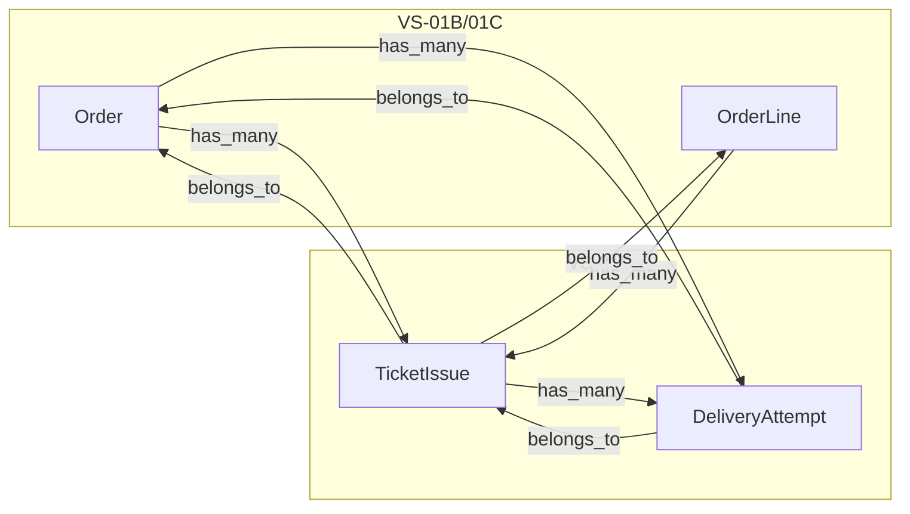

# VS-01D Ticket and Delivery Resource Skeletons

## Plan metadata

| Field | Value |
|--------|--------|
| **Plan ID** | `VS-01D-ticket-delivery-skeletons` |
| **Plan version** | `v2` |
| **Status** | Approved — implementation-ready (v2) |
| **Scope** | VS-01D Ticket and Delivery Resource Skeletons |
| **Authority** | This [`.cursor/plans/vs-01d-ticket-delivery-skeletons.plan.md`](.cursor/plans/vs-01d-ticket-delivery-skeletons.plan.md) file is the **active implementation contract** for VS-01D. The [VS-01D feature pack](docs/fastcheck_sales/feature_packs/0008_VS-01D_ticket-and-delivery-resource-skeletons/VS-01D-FEATURE_PACK.md) remains the upstream planning source. [VS-01B](docs/fastcheck_sales/handoffs/VS-01B_IMPLEMENTATION_HANDOFF.md) and [VS-01C](docs/fastcheck_sales/handoffs/VS-01C_IMPLEMENTATION_HANDOFF.md) handoffs define merged implementation reality. On conflict, this plan wins for implementation sequencing and test ownership. |
| **Last updated** | 2026-06-15 |

### Revision log

- `v1` — initial VS-01D implementation plan based on VS-01C handoff and VS-01D feature pack
- `v2` — approved with required fixes: canonical plan metadata, full sensitive-field list, committed canonical plan file, branch-only workflow, non-hard-coded migration timestamp, explicit `attempt_number >= 1` CHECK + DB failure test

### Canonical plan file (committed in this PR)

The `.cursor/plans/vs-01d-ticket-delivery-skeletons.plan.md` file is **intentionally committed** in the VS-01D slice because it is the canonical active plan per repo plan governance.

- Do **not** create duplicate VS-01D plan files.
- Do **not** leave another active VS-01D plan unmarked.
- Do **not** use filename cloning for versioning; bump version inside this file only.

---

## Planning verdict

Slice Planning Report validated against VS-01D feature pack, merged VS-01C code/tests, and accepted VS-00A–VS-00D decisions.

**Status: APPROVED — implementation-ready (v2).**

---

# Slice Planning Report — VS-01D Ticket and Delivery Resource Skeletons

## Previous Implementation Contracts Reviewed

### Handoff docs read

- [docs/fastcheck_sales/handoffs/README.md](docs/fastcheck_sales/handoffs/README.md)
- [docs/fastcheck_sales/handoffs/VS-01C_IMPLEMENTATION_HANDOFF.md](docs/fastcheck_sales/handoffs/VS-01C_IMPLEMENTATION_HANDOFF.md) (direct predecessor)
- [docs/fastcheck_sales/handoffs/VS-01B_IMPLEMENTATION_HANDOFF.md](docs/fastcheck_sales/handoffs/VS-01B_IMPLEMENTATION_HANDOFF.md) (foundation)

No VS-01A handoff exists in `handoffs/`; VS-01A scope is covered by merged domain shell + VS-01B handoff.

### Merged PRs reviewed

- **PR #333** — VS-01C checkout and payment resource skeletons (`84abec4`, branch `vs-01c-checkout-payment-skeletons`)
- **PR #331** — VS-01B core Sales resource skeletons (`daab688`, branch `vs-01b-core-sales-resource-skeletons`)

### Existing modules/resources/tables now available

- **Domain:** [lib/fastcheck/sales.ex](lib/fastcheck/sales.ex) registers 7 resources through VS-01C
- **Resources:** `TicketOffer`, `Order`, `OrderLine`, `StateTransition`, `CheckoutSession`, `PaymentAttempt`, `PaymentEvent`
- **Tables (7):** `sales_ticket_offers`, `sales_orders`, `sales_order_lines`, `sales_state_transitions`, `sales_checkout_sessions`, `sales_payment_attempts`, `sales_payment_events`
- **Migrations:** `20260615110000_create_core_sales_resource_skeletons.exs`, `20260615120000_create_checkout_and_payment_resource_skeletons.exs`

### Tests that protect the existing boundary

- [test/fastcheck/sales/domain_shell_test.exs](test/fastcheck/sales/domain_shell_test.exs) — exact 7-resource registration + file inventory
- [test/fastcheck/sales/core_resource_skeletons_test.exs](test/fastcheck/sales/core_resource_skeletons_test.exs) — VS-01B skeleton shape (unchanged scope)
- [test/fastcheck/sales/core_resource_migrations_test.exs](test/fastcheck/sales/core_resource_migrations_test.exs) — VS-01B four-table subset only (Option A)
- [test/fastcheck/sales/core_resource_boundary_test.exs](test/fastcheck/sales/core_resource_boundary_test.exs) — forbids `TicketIssue`, `DeliveryAttempt`, `Conversation`
- [test/fastcheck/sales/checkout_and_payment_resource_skeletons_test.exs](test/fastcheck/sales/checkout_and_payment_resource_skeletons_test.exs) — VS-01C resource metadata/actions/relationships/sensitive fields
- [test/fastcheck/sales/checkout_and_payment_resource_migrations_test.exs](test/fastcheck/sales/checkout_and_payment_resource_migrations_test.exs) — full 7-table inventory + schema/index/FK coverage
- [test/fastcheck/sales/vs_01c_boundary_test.exs](test/fastcheck/sales/vs_01c_boundary_test.exs) — forbids later resources and runtime paths

### Decisions already encoded in code/docs

- **`event_scoped_first`** access; **`organization_id` deferred** (no column on Sales tables)
- Integer cents for money; `utc_datetime` timestamps
- Read-only skeletons: `:read`, `:get_by_id` (+ slice-specific list reads); no `:create`/`:update`/`:destroy`
- No generic `update_status` / `update_state`
- Ash `sensitive?: true` on provider/token fields (VS-01C pattern)
- Status vocabularies enforced via Postgres `CHECK` constraints in migrations (VS-01B/01C pattern)
- Named partial unique indexes + Ash `identities` with `identity_index_names`
- `PaymentEvent` has no FK to `PaymentAttempt`
- `attendee_id` on TicketIssue must remain an external Ecto reference (no Ash `belongs_to` to `FastCheck.Attendees.Attendee`)

### Known limitations and deferred work from previous slices

- No checkout workflow, Redis holds, Paystack, webhooks, Oban, ticket issuance, delivery, policies, or UI
- Ash policies deferred to VS-01F
- Index audit deferred to VS-01G
- `TicketIssue` / `DeliveryAttempt` explicitly absent through VS-01C

### What this slice must reuse instead of recreate

- `FastCheck.Sales` domain registration pattern from [lib/fastcheck/sales.ex](lib/fastcheck/sales.ex)
- Ash resource structure from [lib/fastcheck/sales/payment_attempt.ex](lib/fastcheck/sales/payment_attempt.ex) and [lib/fastcheck/sales/order_line.ex](lib/fastcheck/sales/order_line.ex)
- Migration style from [priv/repo/migrations/20260615120000_create_checkout_and_payment_resource_skeletons.exs](priv/repo/migrations/20260615120000_create_checkout_and_payment_resource_skeletons.exs)
- Test helpers/patterns from [test/fastcheck/sales/checkout_and_payment_resource_skeletons_test.exs](test/fastcheck/sales/checkout_and_payment_resource_skeletons_test.exs)
- Option A migration test ownership (VS-01C handoff): keep `core_resource_migrations_test.exs` VS-01B-scoped; new VS-01D migration test owns expanded `sales_%` inventory

---

## 1. Slice Understanding

**Goal:** Add durable Postgres/Ash skeletons for ticket issuance audit (`TicketIssue`) and delivery attempt audit (`DeliveryAttempt`) so later slices can implement idempotent issuance, WhatsApp-first delivery, scanner-safe revocation, and admin support queries without reshaping core tables.

**Dominant outcome:** Two new cold durable tables (`sales_ticket_issues`, `sales_delivery_attempts`) registered in `FastCheck.Sales` with fields, relationships, identities, indexes, and read-only list actions—nothing that issues tickets, sends messages, or touches scanner/attendee hot paths.

**Why it exists:** VS-01B/01C established order/checkout/payment shape; ticket and delivery audit layers are the next durable foundation before VS-01F (policies), VS-08 (token generation), VS-09x (issuance), and VS-11+ (delivery/customer pages).

**Future slices enabled:** VS-01F, VS-01G, VS-08, VS-09A–D, VS-10, VS-11, VS-15A/B.

---

## 2. Readiness and Dependencies

| Dependency | Status |
|---|---|
| VS-01A Ash domain shell | Merged (via VS-01B/01C) |
| VS-01B core resources | Merged (PR #331) |
| VS-01C checkout/payment resources | Merged (PR #333) |
| VS-00A state vocabularies | Accepted — [TICKET_ISSUE_STATE_MACHINE.md](docs/fastcheck_sales/state_machines/TICKET_ISSUE_STATE_MACHINE.md), [DELIVERY_ATTEMPT_STATE_MACHINE.md](docs/fastcheck_sales/state_machines/DELIVERY_ATTEMPT_STATE_MACHINE.md) |
| VS-00B token/PII policy | Accepted — hash-only tokens, PII classification |
| VS-00C inventory contract | Accepted (no Redis work in this slice) |
| VS-00D launch scope | Accepted — `event_scoped_first`, `organization_id` deferred |

**Status: READY** — VS-01C merged; planning gates documented; no missing handoff for direct predecessor.

---

## 3. Current Repo Findings

### Inspected

- Feature pack: [VS-01D-FEATURE_PACK.md](docs/fastcheck_sales/feature_packs/0008_VS-01D_ticket-and-delivery-resource-skeletons/VS-01D-FEATURE_PACK.md)
- Handoffs: VS-01B, VS-01C
- Domain + 7 Sales resources under `lib/fastcheck/sales/`
- Migrations `20260615110000_*`, `20260615120000_*`
- All 7 files under `test/fastcheck/sales/`
- VS-00A state machines, VS-00B security docs, VS-01B/01C slice docs
- Prior plan pattern: [.cursor/plans/vs-01c-checkout-payment-skeletons.plan.md](.cursor/plans/vs-01c-checkout-payment-skeletons.plan.md)

### Reuse

- Ash 3.x + AshPostgres `use Ash.Resource` + `postgres do table/repo/identity_index_names`
- `defaults([:read])` + custom `read :get_by_id` + filtered list reads (VS-01D uses feature-pack names `list_by_order`, `list_by_order_line`, etc.)
- Migration `CHECK` constraints for status vocabularies
- `sensitive?: true` on hash/PII/restricted fields (see § Sensitive fields)
- `belongs_to` with `source_attribute(:sales_order_id)` pattern
- Test assertion helpers from VS-01C skeleton tests

### Missing (expected — this slice creates)

- `lib/fastcheck/sales/ticket_issue.ex`
- `lib/fastcheck/sales/delivery_attempt.ex`
- Migration for 2 tables
- VS-01D tests and slice doc

### Conventions to follow

- Module header `@moduledoc` describing FastCheck Sales architecture role
- Single grouped migration per slice (VS-01C precedent)
- **Migration filename:** use the actual current timestamp generated during implementation; suffix must be `create_ticket_and_delivery_resource_skeletons.exs` (do not hard-code timestamp)
- Explicit named indexes (`*_uidx`, `*_idx`)
- Partial unique indexes for nullable unique fields
- `on_delete: :restrict` FKs to Sales tables
- No `organization_id` column
- No Attendee Ash relationship or attendee table migration
- Beads tracking + Dolt sync before/after work (per AGENTS.md)
- **Branch-only workflow** (no worktrees)

---

## 4. In Scope

- Register `FastCheck.Sales.TicketIssue` and `FastCheck.Sales.DeliveryAttempt` in domain
- Create Ash resource modules with all contract fields, relationships, identities, read/list actions
- One migration creating `sales_ticket_issues` and `sales_delivery_attempts` with FKs, CHECK constraints, indexes
- Declarative `has_many` on `Order` (`:ticket_issues`, `:delivery_attempts`) and `OrderLine` (`:ticket_issues`)
- `TicketIssue.has_many :delivery_attempts`
- Mark all sensitive/restricted attributes with `sensitive?: true` (see § Sensitive fields)
- RED/GREEN tests: resource registration, migration shape, fields, relationships, indexes, forbidden actions, boundary guards
- Slice doc: `docs/fastcheck_sales/slices/VS-01D_TICKET_AND_DELIVERY_RESOURCE_SKELETONS.md`
- **Commit this canonical plan file** in the VS-01D PR
- Update `domain_shell_test`, `core_resource_boundary_test`, `vs_01c_boundary_test` (remove TicketIssue/DeliveryAttempt from forbidden lists)

---

## 5. Out of Scope

Strictly forbidden per feature pack:

- `Conversation`, `TicketDeliveryToken` resources
- `FastCheck.Tickets.*`, `FastCheck.Messaging.WhatsApp.*`, `FastCheck.Payments.Paystack.*`, `lib/fastcheck/workers/*`
- QR rendering/encoding, ticket-code generation, delivery-token generation
- Attendee creation/mutation, scanner/mobile/Android changes
- Ticket issuance orchestration, revocation workflow, delivery sending/resend
- Redis, Paystack, Meta/WhatsApp, email, Oban, webhooks, controllers, LiveView
- Workflow actions (`create_pending`, `mark_issued`, `issue_ticket`, `send_whatsapp`, `generic update_status`, etc.)
- Ash policies (VS-01F)
- `organization_id` column
- Ash `belongs_to` to existing `Attendee`
- Delivery states on `TicketIssue.status` (e.g. `delivered`, `delivery_failed`)
- Raw Meta/WhatsApp payload storage

---

## Sensitive / restricted fields (mandatory)

Mark sensitive/restricted attributes with `sensitive?: true` where Ash supports it:

| Field | Resource |
|---|---|
| `ticket_code` | TicketIssue |
| `qr_token_hash` | TicketIssue |
| `delivery_token_hash` | TicketIssue |
| `attendee_id` | TicketIssue |
| `recipient` | DeliveryAttempt |
| `provider_error_message` | DeliveryAttempt |
| `failure_reason` | DeliveryAttempt |

Rules:

- Do **not** log or expose these values in tests, UI, controllers, workers, or broad list reads.
- `attendee_id` is an external Ecto/scanner-linked reference and must be treated as restricted even without an FK.
- Store only `*_hash` token columns; never plaintext `delivery_token` or `qr_token` attributes.

Skeleton tests must assert all seven fields are marked `sensitive?: true` on the correct resources.

---

## 6. Proposed File Changes

| File path | Create/Update/Delete | Why needed | Notes |
|---|---|---|---|
| [lib/fastcheck/sales/ticket_issue.ex](lib/fastcheck/sales/ticket_issue.ex) | Create | Ticket issuance audit resource | Read/list only; identities for idempotency |
| [lib/fastcheck/sales/delivery_attempt.ex](lib/fastcheck/sales/delivery_attempt.ex) | Create | Delivery attempt audit resource | Read/list only |
| [lib/fastcheck/sales.ex](lib/fastcheck/sales.ex) | Update | Register 2 new resources | Total 9 resources |
| [lib/fastcheck/sales/order.ex](lib/fastcheck/sales/order.ex) | Update | `has_many :ticket_issues`, `has_many :delivery_attempts` | Declarative only |
| [lib/fastcheck/sales/order_line.ex](lib/fastcheck/sales/order_line.ex) | Update | `has_many :ticket_issues` | Declarative only |
| `priv/repo/migrations/*_create_ticket_and_delivery_resource_skeletons.exs` | Create | Both tables + constraints/indexes | Use **actual** migration timestamp at implementation time |
| [test/fastcheck/sales/ticket_and_delivery_resource_skeletons_test.exs](test/fastcheck/sales/ticket_and_delivery_resource_skeletons_test.exs) | Create | Resource metadata, actions, relationships, sensitive fields | Mirror VS-01C skeleton test |
| [test/fastcheck/sales/ticket_and_delivery_resource_migrations_test.exs](test/fastcheck/sales/ticket_and_delivery_resource_migrations_test.exs) | Create | 9-table inventory, columns, indexes, constraint failures | Option A owner for full inventory |
| [test/fastcheck/sales/vs_01d_boundary_test.exs](test/fastcheck/sales/vs_01d_boundary_test.exs) | Create | Forbid Conversation, tickets/*, workers, etc. | New boundary slice test |
| [test/fastcheck/sales/domain_shell_test.exs](test/fastcheck/sales/domain_shell_test.exs) | Update | 9-resource registration + file inventory | |
| [test/fastcheck/sales/core_resource_boundary_test.exs](test/fastcheck/sales/core_resource_boundary_test.exs) | Update | Remove TicketIssue/DeliveryAttempt from forbidden | Keep Conversation forbidden |
| [test/fastcheck/sales/vs_01c_boundary_test.exs](test/fastcheck/sales/vs_01c_boundary_test.exs) | Update | Remove TicketIssue/DeliveryAttempt from forbidden | Preserve VS-01C runtime-path guards |
| [docs/fastcheck_sales/slices/VS-01D_TICKET_AND_DELIVERY_RESOURCE_SKELETONS.md](docs/fastcheck_sales/slices/VS-01D_TICKET_AND_DELIVERY_RESOURCE_SKELETONS.md) | Create | Implemented boundary documentation | |
| [.cursor/plans/vs-01d-ticket-delivery-skeletons.plan.md](.cursor/plans/vs-01d-ticket-delivery-skeletons.plan.md) | Create | Canonical active plan (this file) | **Committed in VS-01D PR** |

**Must NOT touch:** `lib/fastcheck/attendees/*`, scanner/mobile/Android, `lib/fastcheck_web/*`, existing attendee migrations, Redis/Paystack/WhatsApp paths.

---

## 7. Reuse Plan

| Existing artifact | Reuse for |
|---|---|
| `FastCheck.Sales` domain | Register new resources |
| `Order`, `OrderLine` | Parent relationships |
| `PaymentAttempt` resource | Ash attribute/relationship/sensitive-field pattern |
| `OrderLine.list_for_order` pattern | Filtered read actions (use VS-01D action names from pack) |
| VS-01C migration | CHECK constraints, partial uniques, named indexes, FK style |
| `checkout_and_payment_resource_skeletons_test.exs` | Test structure and helper functions |
| `checkout_and_payment_resource_migrations_test.exs` | Column/index/constraint assertion patterns |
| VS-00A state machine docs | Status CHECK constraint vocabularies |

**No new shared helper modules proposed.** Copy private test helpers locally (same as VS-01C).

---

## 8. Minimal Implementation Approach



1. **Beads:** Verify `bd`, create/claim VS-01D bead, `bd dolt start` if needed.
2. **Branch (branch-only workflow):**
   ```bash
   git switch main
   git pull origin main
   git switch -c vs-01d-ticket-delivery-skeletons
   ```
3. **RED tests first:** Update domain/boundary tests to expect 9 resources; add skeleton/migration/boundary tests that fail on missing modules/tables.
4. **Migration:** Generate with current timestamp; name must end with `create_ticket_and_delivery_resource_skeletons.exs`. Create both tables in one migration:
   - `sales_ticket_issues`: required `sales_order_id`, `sales_order_line_id`, `line_item_sequence`, `status`; nullable `attendee_id`, tokens, scanner fields, timestamps
   - `sales_delivery_attempts`: required `sales_order_id`, `ticket_issue_id`, `channel`, `status`, `attempt_number`; nullable provider/PII/audit fields
   - FKs: order, order_line, ticket_issue (`on_delete: :restrict`); **no FK on `attendee_id`**
   - CHECK constraints:
     - `sales_ticket_issues_status_valid` — issuance states only
     - `sales_delivery_attempts_status_valid` — VS-00A delivery vocabulary
     - `sales_ticket_issues_line_item_sequence_positive` — `line_item_sequence >= 1`
     - `sales_delivery_attempts_attempt_number_positive` — `attempt_number >= 1`
     - optional `channel` CHECK: `whatsapp`, `email`, `admin`, `system`
   - Indexes/identities per feature pack §6–7
5. **Ash resources:** Implement fields, relationships, identities mirroring migration names; mark all seven sensitive/restricted fields `sensitive?: true` (see § Sensitive fields).
6. **Order/OrderLine:** Add declarative `has_many` only.
7. **Domain:** Register both resources; update `@moduledoc` to VS-01D.
8. **GREEN:** Fix failures; run verification commands.
9. **Docs:** Add VS-01D slice doc; ensure this canonical plan file is committed.
10. **Close bead** with resolution summary + Dolt sync.

---

## 9. Data / State / Schema Plan

### Tables affected (new)

- **`sales_ticket_issues`**
  - Fields per feature pack §6
  - Identities: partial unique `ticket_code`; unique `(sales_order_line_id, line_item_sequence)`; partial unique `attendee_id`
  - Indexes: `sales_order_id`, `sales_order_line_id`, `status`, `scanner_status`
  - `status` CHECK: issuance only (`pending`, `issued`, `revoked`, `manual_review`)
  - `line_item_sequence` CHECK: `>= 1`
  - `scanner_status`: nullable string (vocabulary deferred to VS-09C/15A)

- **`sales_delivery_attempts`**
  - Fields per feature pack §7
  - Indexes: `(sales_order_id, status)`, `(ticket_issue_id, status)`, `provider_message_id`, `(channel, status, inserted_at)`, `correlation_id`
  - `status` CHECK: delivery vocabulary from VS-00A
  - `attempt_number` CHECK: `sales_delivery_attempts_attempt_number_positive CHECK (attempt_number >= 1)`

### Migration safety

- Additive only; no changes to `attendees` or scanner tables
- `attendee_id` indexed but not FK-constrained (legacy/external reference)
- Partial uniques prevent duplicate issuance units without requiring populated nullable fields at skeleton stage
- Use `on_delete: :restrict` on Sales FKs

### State transitions

None implemented in this slice (read-only skeleton).

---

## 10. Test Plan — RED / GREEN

### RED (fail before implementation)

- `FastCheck.Sales.TicketIssue` / `DeliveryAttempt` modules missing
- Domain registers 7 not 9 resources
- `sales_ticket_issues` / `sales_delivery_attempts` tables missing
- Required columns/indexes/identities missing
- Relationships missing on resources and Order/OrderLine
- Forbidden workflow actions present (`issue_ticket`, `mark_sent`, `send_whatsapp`, etc.)
- `TicketIssue.status` includes delivery states
- Plaintext `delivery_token` / `qr_token` attributes exist
- `organization_id` on new resources
- Forbidden paths created (`lib/fastcheck/tickets/*`, etc.)
- Sensitive fields not marked `sensitive?: true`

### GREEN (must pass after)

- `mix compile --warnings-as-errors`
- `mix format --check-formatted`
- `mix test test/fastcheck/sales/` — all Sales tests green
- `mix precommit` — full gate
- 9-table `sales_%` inventory exact match
- Duplicate `(sales_order_line_id, line_item_sequence)` insert rejected at DB
- Partial unique violations for `ticket_code` and `attendee_id` when non-null
- Read/list actions work via Ash (smoke: empty list queries compile/run)
- All seven sensitive/restricted fields marked; tests do not log or expose values

### Regression tests to keep green

All tests listed in VS-01C handoff §Next Agent Guidance, with boundary updates noted above.

### Failure-path tests

- DB constraint failure for invalid `TicketIssue.status` (e.g. `delivered`)
- DB constraint failure for invalid `DeliveryAttempt.status`
- Duplicate line-item sequence insert raises
- **DB constraint failure for `attempt_number = 0`** on `sales_delivery_attempts` (proves `sales_delivery_attempts_attempt_number_positive`)

---

## 11. Performance and Scaling Review

- **Hot data:** Not applicable — no runtime hot path added
- **Warm data:** Not applicable
- **Cold data:** `TicketIssue`, `DeliveryAttempt` — durable Postgres audit
- **Redis representation:** Not applicable
- **Cache/TTL strategy:** Not applicable
- **Invalidation triggers:** Not applicable
- **PubSub events:** Not applicable
- **Oban/background jobs:** Not applicable
- **Index requirements:** As feature pack §6–7; prepares admin/support and idempotent issuance queries
- **High-concurrency risks:** Low — skeleton only; unique indexes prepare for future duplicate-worker safety (VS-09A/09C)
- **Avoid unnecessary DB calls:** Read-only list actions with indexed filter columns; no N+1 patterns introduced (no UI)

---

## 12. Security and Privacy Review

- **PII added or touched:** `recipient`; `provider_error_message`, `failure_reason` as restricted support data; `ticket_code` as sensitive customer ticket identifier; `attendee_id` as restricted external/scanner-linked reference
- **Token/secret handling:** `qr_token_hash`, `delivery_token_hash` — hash-only columns; Ash `sensitive?: true`; no plaintext token attributes
- **Raw payload handling:** None introduced
- **Logging rules:** Do not log `ticket_code`, `attendee_id`, `recipient`, token hashes, provider errors, or failure reasons
- **Access control / policy concerns:** Policies deferred to VS-01F; skeleton must not block future field-level restrictions
- **Audit requirements:** Tables are audit-oriented; no transition recording in this slice
- **Abuse/rate-limit concerns:** Not applicable (no public endpoints)

---

## 13. Edge Cases and Failure Modes

| Edge case | Handling |
|---|---|
| Duplicate `line_item_sequence` per order line | Unique index + migration test insert failure |
| Two non-null `ticket_code` values collide | Partial unique index rejects |
| Two TicketIssues link same `attendee_id` | Partial unique index rejects |
| `attendee_id` references non-existent attendee | Allowed at skeleton (no FK); later slices validate |
| Delivery status placed on TicketIssue | CHECK constraint + test rejects `delivered` on TicketIssue |
| `attempt_number = 0` | CHECK `sales_delivery_attempts_attempt_number_positive` rejects |
| Nullable token fields at skeleton | Partial uniques only apply when populated |
| Orphan DeliveryAttempt without TicketIssue | Prevented by NOT NULL FK on `ticket_issue_id` |

---

## 14. Branch and Commit Plan

- **Branch:** `vs-01d-ticket-delivery-skeletons`
- **Workflow:** branch-only (no worktrees)
  ```bash
  git switch main
  git pull origin main
  git switch -c vs-01d-ticket-delivery-skeletons
  ```
- **Commit style:** Single focused commit (or test-first then impl), matching repo:
  - `feat(sales): VS-01D ticket and delivery resource skeletons`
- Include canonical plan file `.cursor/plans/vs-01d-ticket-delivery-skeletons.plan.md` in the PR.

---

## 15. Verification Commands

```bash
bd dolt status
bd ready
mix deps.get
mix ecto.migrate
mix format --check-formatted
mix compile --warnings-as-errors
mix test test/fastcheck/sales/
mix precommit
```

Android/Gradle commands not applicable.

---

## 16. Reviewer Checklist

- [ ] Only `TicketIssue` and `DeliveryAttempt` added to Sales domain (9 total resources)
- [ ] No `Conversation` or `TicketDeliveryToken`
- [ ] Single migration adds exactly 2 tables (9 `sales_%` total); timestamp not hard-coded in plan-only paths
- [ ] No `organization_id` on new tables
- [ ] `TicketIssue` has `line_item_sequence` + unique `(sales_order_line_id, line_item_sequence)`
- [ ] Partial uniques on `ticket_code` and `attendee_id`
- [ ] `TicketIssue.status` is issuance-only; no delivery states
- [ ] `DeliveryAttempt` is delivery audit source of truth
- [ ] `attempt_number >= 1` CHECK constraint + DB failure test for `attempt_number = 0`
- [ ] No workflow/mutating Ash actions
- [ ] No Attendee/scanner/mobile/Paystack/Redis/WhatsApp/ticket generator code
- [ ] All seven sensitive fields marked `sensitive?: true`; not logged in tests
- [ ] `attendee_id` has no Ash relationship to Attendee
- [ ] Order/OrderLine changes are relationship-only
- [ ] Option A test ownership preserved (`core_resource_migrations_test` still 4-table subset)
- [ ] Canonical plan file committed at `.cursor/plans/vs-01d-ticket-delivery-skeletons.plan.md`
- [ ] No duplicate active VS-01D plan files
- [ ] `mix test test/fastcheck/sales/` and `mix precommit` pass
- [ ] VS-01D slice doc present

---

## 17. Final Planning Verdict

**APPROVED — implementation-ready (v2)**

VS-01C is merged with a complete handoff; VS-00A–VS-00D decisions are documented and consistent with implemented VS-01B/01C code. Required reviewer fixes (canonical metadata, sensitive-field list, committed plan file, branch-only workflow, migration timestamp rule, `attempt_number` CHECK + test) are incorporated in v2.
