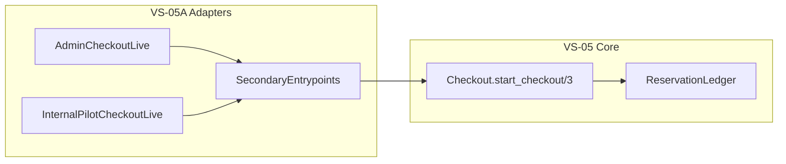

# Slice Planning Report — VS-05A Secondary Sales Entry Points

**Plan ID:** VS-05A  
**Plan version:** v2.1  
**Status:** GO — approved for implementation  
**Scope:** Secondary Sales Entry Points — admin-assisted + internal-pilot only  
**Authority:** Feature pack [VS-05A-FEATURE_PACK.md](docs/fastcheck_sales/feature_packs/0018_VS-05A_secondary-sales-entry-points/VS-05A-FEATURE_PACK.md). VS-00D launch scope wins on web-checkout deferral.  
**Canonical plan to be created on the implementation branch:** `.cursor/plans/vs-05a-secondary-sales-entry-points.plan.md` (this file is not on `main` until the VS-05A PR lands).

### Revision log
- `v1` — initial plan from repo inspection and predecessor handoffs
- `v2` — reviewer conditional GO patches: idempotency per mount, Ash read-action usage, LiveView session auth, safe event lookup, handoff removed from PR scope, expanded boundary/offer/idempotency tests
- `v2.1` — final GO; canonical plan path wording corrected (created on implementation branch, not assumed on `main`); PR hard review gates added

---

## Previous Implementation Contracts Reviewed

**Handoff docs read:**
- [docs/fastcheck_sales/handoffs/README.md](docs/fastcheck_sales/handoffs/README.md)
- [docs/fastcheck_sales/handoffs/VS-05_IMPLEMENTATION_HANDOFF.md](docs/fastcheck_sales/handoffs/VS-05_IMPLEMENTATION_HANDOFF.md) (direct predecessor)
- [docs/fastcheck_sales/handoffs/VS-01F_IMPLEMENTATION_HANDOFF.md](docs/fastcheck_sales/handoffs/VS-01F_IMPLEMENTATION_HANDOFF.md)
- [docs/fastcheck_sales/handoffs/VS-03_IMPLEMENTATION_HANDOFF.md](docs/fastcheck_sales/handoffs/VS-03_IMPLEMENTATION_HANDOFF.md)
- [docs/fastcheck_sales/handoffs/VS-04C_IMPLEMENTATION_HANDOFF.md](docs/fastcheck_sales/handoffs/VS-04C_IMPLEMENTATION_HANDOFF.md) (inventory context; not a hard gate)

**VS-00D (no handoff — docs-only slice):**
- [docs/fastcheck_sales/slices/VS-00D_MVP_PURCHASE_ENTRY_POINT_AND_LAUNCH_SCOPE_DECISION.md](docs/fastcheck_sales/slices/VS-00D_MVP_PURCHASE_ENTRY_POINT_AND_LAUNCH_SCOPE_DECISION.md)
- [docs/fastcheck_sales/product/SELECTED_LAUNCH_SCOPE.md](docs/fastcheck_sales/product/SELECTED_LAUNCH_SCOPE.md)

**Merged PRs reviewed (via handoffs):**
- #351 — VS-05 order and checkout core
- #339 — VS-01F Ash policy foundation
- #345 — VS-03 ticket offer management
- #353 — VS-04C inventory reconciliation (parallel; not a hard gate)

**Existing modules/resources now available:**
- `FastCheck.Sales.Checkout.start_checkout/3` — sole checkout orchestration ([lib/fastcheck/sales/checkout.ex](lib/fastcheck/sales/checkout.ex))
- `FastCheck.Sales.TicketOffer` — Ash read actions `:list_active_for_event`, `:get_available_for_checkout` ([lib/fastcheck/sales/ticket_offer.ex](lib/fastcheck/sales/ticket_offer.ex))
- `FastCheck.Sales.PolicyChecks` — actor type + event-scope filters
- `FastCheck.Sales.StateTransitionSupport` — sanitized transition metadata
- `FastCheck.Sales.Inventory.ReservationLedger` — hot inventory (called only from checkout core)
- `FastCheck.SalesCheckoutFixtures` — actors, offers, checkout input ([test/support/sales_checkout_fixtures.ex](test/support/sales_checkout_fixtures.ex))
- Dashboard auth: `FastCheckWeb.Plugs.BrowserAuth` + `[:browser, :dashboard_auth]` pipeline ([lib/fastcheck_web/router.ex](lib/fastcheck_web/router.ex))

**Tests protecting existing boundary:**
- `test/fastcheck/sales/order_checkout_core_test.exs`
- `test/fastcheck/sales/checkout_idempotency_test.exs`
- `test/fastcheck/sales/checkout_policy_test.exs` — **operators forbidden** for checkout
- `test/fastcheck/sales/checkout_session_test.exs`
- `test/fastcheck/sales/checkout_inventory_boundary_test.exs`
- `test/fastcheck/sales/ticket_offer_test.exs` + `ticket_offer_policy_test.exs`
- `test/fastcheck/sales/vs_01f_policy_test.exs` + `vs_01f_boundary_test.exs`
- Full `test/fastcheck/sales/` suite (151+ tests at VS-05 merge)

**Decisions already encoded in code/docs:**
- WhatsApp-first production; secondary paths are adapters only
- VS-00D locks **before-launch** paths: `admin_assisted_sales`, `internal_pilot_sales`; **defers** `web_checkout_sales`
- Checkout actors: `:system`, `:admin`, `:customer_session` only — **`:operator` is forbidden** at checkout
- `source_channel` values include `admin`, `internal_pilot`, `test` (DB constraint migrated in VS-05)
- `internal_pilot` → effective sales channel `"internal"`; `admin` → `"admin"`
- Hold tokens hashed with `SALES_HOLD_TOKEN_PEPPER`; sessions sanitized (no `hold_token` in responses)
- No Sales UI/routes exist yet (`lib/fastcheck_web/live/sales/` absent — confirmed by VS-03 boundary test)
- **No shared LiveView `on_mount` auth hook** — existing LiveViews do not receive `conn.assigns.current_user` automatically

**Known limitations / deferred work:**
- No Paystack init, webhooks, ticket issuance, delivery, WhatsApp
- No per-dashboard-user event ACL — browser auth is single shared admin credential
- No checkout expiry workers, no VS-12 admin order dashboard
- `customer_session` checkout path exists in core but **no public web UI** until a post-launch slice
- **Implementation handoff doc is post-merge only** — not part of implementation PR

**This slice must reuse (not recreate):**
- `Checkout.start_checkout/3` for all checkout creation
- `TicketOffer` Ash read `:list_active_for_event` via `Ash.Query.for_read/3` + `Ash.read/2`
- `SalesCheckoutFixtures` + existing checkout policy tests
- `BrowserAuth` / `dashboard_auth` pipeline for route protection
- Safe event fetch pattern from [occupancy_live.ex](lib/fastcheck_web/live/occupancy_live.ex) (`parse_event_id` + rescue `Ecto.NoResultsError`)

---

## 1. Slice Understanding

**Goal:** Add thin secondary (non-WhatsApp) entrypoints so dashboard-authenticated admins can start Sales checkouts through the same VS-05 core used by future WhatsApp flows.

**Dominant outcome:** Admin-assisted and internal-pilot paths create `awaiting_payment` orders via `Checkout.start_checkout/3` with server-mapped `source_channel` (`admin` / `internal_pilot`), session-scoped idempotency, safe errors, and RED/GREEN tests proving no duplicate business logic.

**Why it exists:** VS-05 shipped the checkout spine without any channel surface. VS-05A validates that spine through controlled secondary paths before WhatsApp (VS-16–20) and Paystack handoff (VS-06B).

**Enables:** VS-06B checkout-to-Paystack testing, VS-11 ticket page journey, VS-12 admin dashboard, VS-18/19 WhatsApp reuse validation.



---

## 2. Readiness and Dependencies

| Dependency | Status |
|---|---|
| VS-00D launch scope decision | **READY** — docs locked; web deferred |
| VS-01F Ash policies | **READY** — merged #339 |
| VS-03 TicketOffer reads | **READY** — merged #345 |
| VS-05 Checkout core | **READY** — merged #351 |
| VS-04B/C inventory | **READY** — not required for adapter slice |
| Plan v2 review patches | **READY** — applied in this document |

**Verdict: READY FOR IMPLEMENTATION** on branch `vs-05a-secondary-sales-entry-points`.

**Scope resolution (VS-00D vs feature-pack defaults):** VS-00D is authoritative. Implement **admin_assisted_sales** + **internal_pilot_sales** only. **Do not implement public web checkout** (no routes, no controllers, no `customer_session` UI).

**Policy note:** Feature pack mentions operator admin-assisted access; **merged VS-05 forbids `:operator` at checkout**. Admin-assisted means **dashboard-authenticated admin actor**, not scanner portal operators.

---

## 3. Current Repo Findings

**Inspected:**
- [lib/fastcheck/sales/checkout.ex](lib/fastcheck/sales/checkout.ex) — `start_checkout/3`, idempotency lookup before create
- [lib/fastcheck/sales/ticket_offer.ex](lib/fastcheck/sales/ticket_offer.ex) — `:list_active_for_event` Ash read action (args: `event_id`, `sales_channel`, `as_of`)
- [lib/fastcheck_web/router.ex](lib/fastcheck_web/router.ex) — `dashboard_auth` pipeline; no Sales routes
- [lib/fastcheck_web/plugs/browser_auth.ex](lib/fastcheck_web/plugs/browser_auth.ex) — session keys `:dashboard_authenticated`, `:dashboard_username`
- [lib/fastcheck_web/live/occupancy_live.ex](lib/fastcheck_web/live/occupancy_live.ex) — safe `parse_event_id` + `fetch_event` rescue pattern
- [test/fastcheck_web/live/dashboard_live_test.exs](test/fastcheck_web/live/dashboard_live_test.exs) — `init_test_session` auth before mount
- [test/support/sales_checkout_fixtures.ex](test/support/sales_checkout_fixtures.ex)
- All seven VS-05 checkout test files

**Reuse:**
- `Checkout.start_checkout/3`
- Ash offer read (not a plain function):

```elixir
TicketOffer
|> Ash.Query.for_read(:list_active_for_event, %{
     event_id: event_id,
     sales_channel: sales_channel,
     as_of: DateTime.utc_now()
   }, actor: actor)
|> Ash.read(authorize?: true)
```

- Safe event lookup in adapter/LiveView (do **not** call `Events.get_event!/1` on user-supplied IDs):

```elixir
with {:ok, event_id} <- parse_event_id(param),
     {:ok, event} <- safe_fetch_event(event_id) do
  ...
end

# safe_fetch_event rescues Ecto.NoResultsError -> {:error, :not_found}
# Mirror occupancy_live.ex fetch_event/1 pattern
```

- `SalesCheckoutFixtures.admin_actor/1` for actor shape
- `BrowserAuth` session keys for LiveView user derivation
- `Layouts.app`, `<.form>`, `<.input>`, `<.card>`

**Missing (expected — this slice adds):**
- `lib/fastcheck/sales/secondary_entrypoints.ex`
- `lib/fastcheck_web/live/sales/admin_checkout_live.ex`
- `lib/fastcheck_web/live/sales/internal_pilot_checkout_live.ex`
- Sales routes, `:sales_internal_pilot_enabled` config, adapter + web tests

**Conventions:**
- Module header `@moduledoc` describing FastCheck architecture role
- LiveViews wrapped in `<Layouts.app>`
- Routes under `/dashboard/...` inside existing `dashboard_auth` scope
- Beads + worktree per AGENTS.md

---

## 4. In Scope

- `FastCheck.Sales.SecondaryEntrypoints` — thin adapter; **only module that calls `Checkout.start_checkout/3`**
- Admin-assisted LiveView at `/dashboard/sales/checkout/:event_id`
- Internal-pilot LiveView at `/dashboard/sales/internal-pilot/checkout/:event_id` (config-gated)
- **Session-scoped idempotency** (see §8)
- **LiveView session auth helper** `dashboard_user_from_session/1` (local to each LiveView or tiny shared private helper in one LiveView file — no broad auth abstraction)
- Safe event lookup (no 500 on bad `event_id`)
- Ash read-action offer listing with channel-specific `sales_channel` filter
- Config `:sales_internal_pilot_enabled` (default `true` dev/test; `false` prod unless env override)
- Safe error translation
- RED/GREEN tests per §10
- Slice doc only: `docs/fastcheck_sales/slices/VS-05A_SECONDARY_SALES_ENTRY_POINTS.md`

---

## 5. Out of Scope

- **Public web checkout** — deferred by VS-00D; `GET /events/:event_id/checkout` must remain **404**
- **`docs/fastcheck_sales/handoffs/VS-05A_IMPLEMENTATION_HANDOFF.md`** — **post-merge only**; must NOT be created in implementation PR
- WhatsApp/Meta, Paystack, tickets, attendees, scanner, mobile, direct Redis
- Duplicate order/session/line creation outside `Checkout.start_checkout/3`
- Ash resource workflow changes (unless compile break — not expected)
- Granting `:operator` checkout access
- Broad `on_mount` auth framework
- Wrapper modules for Ash reads unless duplication forces a **private** helper inside `SecondaryEntrypoints`

**Forbidden shortcuts:** LiveViews calling `Checkout`, `Order`, `CheckoutSession`, or `Redix` directly; trusting client `idempotency_key` or `source_channel` params.

---

## 6. Proposed File Changes

| File path | Create/Update/Delete | Why needed | Notes |
|---|---|---|---|
| [lib/fastcheck/sales/secondary_entrypoints.ex](lib/fastcheck/sales/secondary_entrypoints.ex) | Create | Thin adapter | `start_admin_checkout/3`, `start_internal_pilot_checkout/3`, `list_offers_for_channel/3`, `admin_actor_from_user/2`, `safe_fetch_event/1`, `safe_error_message/1`, `generate_idempotency_key/0` |
| [lib/fastcheck_web/live/sales/admin_checkout_live.ex](lib/fastcheck_web/live/sales/admin_checkout_live.ex) | Create | Admin UI | `dashboard_user_from_session/1`; mount assigns `:idempotency_key`; calls SecondaryEntrypoints only |
| [lib/fastcheck_web/live/sales/internal_pilot_checkout_live.ex](lib/fastcheck_web/live/sales/internal_pilot_checkout_live.ex) | Create | Pilot UI | Same patterns; pilot banner; config gate |
| [lib/fastcheck_web/router.ex](lib/fastcheck_web/router.ex) | Update | Routes | Under `dashboard_auth` scope |
| [config/config.exs](config/config.exs) | Update | Pilot default | `:sales_internal_pilot_enabled` |
| [config/runtime.exs](config/runtime.exs) | Update | Prod gate | `SALES_INTERNAL_PILOT_ENABLED`, default `false` in prod |
| [config/test.exs](config/test.exs) | Update | Test enable | Explicit `true` |
| [test/fastcheck/sales/secondary_entrypoints_test.exs](test/fastcheck/sales/secondary_entrypoints_test.exs) | Create | Adapter tests | Channel map, idempotency replay, offer-channel filters, safe event fetch |
| [test/fastcheck_web/sales/admin_checkout_live_test.exs](test/fastcheck_web/sales/admin_checkout_live_test.exs) | Create | Admin LV tests | Auth, happy path, bad event_id redirect, duplicate submit idempotency |
| [test/fastcheck_web/sales/internal_pilot_checkout_test.exs](test/fastcheck_web/sales/internal_pilot_checkout_test.exs) | Create | Pilot tests | Not public; disabled when config false |
| [test/fastcheck_web/sales/secondary_entrypoints_policy_test.exs](test/fastcheck_web/sales/secondary_entrypoints_policy_test.exs) | Create | Auth + web 404 | Unauthenticated redirect; `GET /events/:id/checkout` → 404 |
| [test/fastcheck_web/sales/secondary_entrypoints_boundary_test.exs](test/fastcheck_web/sales/secondary_entrypoints_boundary_test.exs) | Create | Static scan | See §10 boundary list |
| [test/fastcheck_web/sales/secondary_entrypoints_log_redaction_test.exs](test/fastcheck_web/sales/secondary_entrypoints_log_redaction_test.exs) | Create | PII safety | `capture_log` on submit |
| [docs/fastcheck_sales/slices/VS-05A_SECONDARY_SALES_ENTRY_POINTS.md](docs/fastcheck_sales/slices/VS-05A_SECONDARY_SALES_ENTRY_POINTS.md) | Create | Slice summary | Implementation PR may include this |
| `.cursor/plans/vs-05a-secondary-sales-entry-points.plan.md`](.cursor/plans/vs-05a-secondary-sales-entry-points.plan.md) | Create | Canonical plan | Added on implementation branch `vs-05a-secondary-sales-entry-points` (not on `main` pre-PR) |

**Explicitly NOT in implementation PR:**
- `docs/fastcheck_sales/handoffs/VS-05A_IMPLEMENTATION_HANDOFF.md` — create only after merge when PR number, SHA, and test results are known

---

## 7. Reuse Plan

| Need | Reuse |
|---|---|
| Checkout creation | `FastCheck.Sales.Checkout.start_checkout/3` (SecondaryEntrypoints only) |
| Offer listing | Ash `:list_active_for_event` via `Ash.Query.for_read` + `Ash.read` |
| Event lookup | `Events.get_event_with_stats/1` or `Events.Cache.get_event!/1` inside `safe_fetch_event/1` with `rescue Ecto.NoResultsError` |
| Admin actor shape | `SalesCheckoutFixtures.admin_actor/1` pattern |
| Route protection | `dashboard_auth` pipeline (Plug-level) |
| LiveView user | `dashboard_user_from_session(session)` reading `:dashboard_username` session key |
| Test auth | `init_test_session(%{dashboard_authenticated: true, dashboard_username: "admin"})` |
| Idempotency semantics | VS-05 `checkout_idempotency_test.exs` — replay on matching key |

**New helper justification:** `SecondaryEntrypoints` centralizes channel rules and is the sole caller of checkout core. `dashboard_user_from_session/1` is a tiny local helper because LiveViews lack conn assigns and there is no shared `on_mount` hook today.

---

## 8. Minimal Implementation Approach

1. **Beads + worktree:** `bd create` for VS-05A; branch `vs-05a-secondary-sales-entry-points`; claim bead.
2. **RED — adapter tests:** Channel mapping, offer-channel filters, idempotency replay with same key, safe event fetch on missing ID. Run — expect failures.
3. **RED — web tests:** Policy (unauth redirect, web 404), static boundary scan, log redaction, LiveView duplicate-submit idempotency. Run — expect failures.
4. **Implement `SecondaryEntrypoints`:**
   - `safe_fetch_event/1` — parse + fetch + `{:error, :not_found}` (no raise)
   - `list_offers_for_channel(actor, event_id, sales_channel)` — Ash read action as documented in §3
   - `admin_actor_from_user(%{username: u}, event_id)` → `%{actor_type: :admin, user_id: u, allowed_event_ids: [event_id]}`
   - `start_*_checkout(user, event_id, params, idempotency_key)` — **ignore** `source_channel` / `idempotency_key` from params; use function args
   - Hard-code `source_channel` (`"admin"` / `"internal_pilot"`)
   - Call `Checkout.start_checkout/3`; return `%{public_reference:, order_id:}` only
5. **Config:** `:sales_internal_pilot_enabled`
6. **LiveViews:**
   - `mount/3`: `dashboard_user_from_session(session)`; `parse_event_id` + `safe_fetch_event`; on `:not_found` → flash + `push_navigate` to `~p"/dashboard"`
   - **Idempotency:** on successful mount → `assign(:idempotency_key, SecondaryEntrypoints.generate_idempotency_key())`
   - **Submit:** pass `socket.assigns.idempotency_key` to SecondaryEntrypoints
   - **On success:** rotate key (`assign(:idempotency_key, generate_new())`) + success flash with `public_reference`
   - **On validation/checkout error:** keep same key for retry
   - **Explicit reset** (if UI provides "start over"): rotate key
   - LiveViews call **only** SecondaryEntrypoints — never `Checkout` directly
7. **Router:** two `live` routes under existing `dashboard_auth` scope
8. **GREEN** + regression + `mix precommit`
9. **Docs:** slice summary only — **no handoff file**

### Idempotency contract (mandatory)

```text
mount  -> generate idempotency_key -> socket.assigns.idempotency_key
submit -> use socket.assigns.idempotency_key (never trust params)
success -> rotate key
validation / checkout error -> keep same key
explicit reset -> rotate key
```

Never accept `idempotency_key` from client params as trusted input.

---

## 9. Data / State / Schema Plan

**No data/schema/migration changes expected.**

---

## 10. Test Plan — RED / GREEN

**RED (write first):**
- `admin-assisted checkout uses approved checkout core` — order with `source_channel: "admin"`
- `admin checkout maps source_channel server-side` — spoofed param ignored
- `internal pilot checkout uses source_channel internal_pilot`
- **`duplicate submit reuses idempotency key until success`** — two submits with same socket key → one order (VS-05 replay); after success, new key → new order allowed
- **`admin-assisted lists offers with sales_channel admin or all only`**
- **`internal-pilot lists offers with sales_channel internal or all only`**
- **`disabled/archived/out-of-window offers excluded`** from both lists
- `internal pilot checkout is not public` — unauthenticated → `/login`
- `internal pilot disabled when config false`
- **`GET /events/:event_id/checkout returns 404`** — proves web deferred
- **`invalid event_id does not 500`** — e.g. `/dashboard/sales/checkout/999999` → safe redirect/flash
- **Static boundary test** scans these files:

```text
lib/fastcheck/sales/secondary_entrypoints.ex
lib/fastcheck_web/live/sales/admin_checkout_live.ex
lib/fastcheck_web/live/sales/internal_pilot_checkout_live.ex
```

Must **reject** source containing:

```text
Redix
sales:offer:
sales:hold:
Paystack
WhatsApp
TicketIssue
Attendee
CheckoutSession |> Changeset
Order |> Changeset
OrderLine |> Changeset
```

LiveViews must not call `Checkout.start_checkout` — only SecondaryEntrypoints may, and only via that function.

- `errors do not leak PII or internals` — `capture_log` + HTML refute buyer email, `hold_token`, stack traces

**GREEN:** All above + existing VS-05 checkout tests + scanner/mobile smoke unchanged.

---

## 11. Performance and Scaling Review

- **Hot data:** Redis inventory via `ReservationLedger` inside checkout only
- **Warm data:** Ash `:list_active_for_event` per mount — indexed VS-03 filters; small per-event sets
- **Cold data:** Orders/sessions written on submit via checkout core
- **Redis representation:** Not applicable in adapters
- **Cache/TTL strategy:** Event fetch may use Events cache; no inventory polling from LiveView
- **Invalidation triggers:** Not applicable
- **PubSub events:** Not applicable
- **Oban/background jobs:** Not applicable
- **Index requirements:** None new
- **High-concurrency risks:** Low; idempotency prevents duplicate orders on double-submit
- **Avoid unnecessary DB calls:** Load offers once on mount; no order/session listing

---

## 12. Security and Privacy Review

- **PII:** Form fields only; never log/flash buyer data
- **Token/secret handling:** No `hold_token` or raw idempotency keys in UI/logs
- **Raw payload handling:** None
- **Logging:** Adapter follows checkout core pattern
- **Access control:** `dashboard_auth` + pilot config gate
- **Audit:** Transitions via checkout core only
- **Abuse/rate-limit:** Existing browser `RateLimiter`

---

## 13. Edge Cases and Failure Modes

| Edge case | Handling |
|---|---|
| Invalid/missing `event_id` | `parse_event_id` → `safe_fetch_event` → flash + redirect; **no 500** |
| No active offers | Empty list + disabled submit |
| Offer disabled mid-form | `:sales_disabled` → safe message; **keep idempotency key** |
| Insufficient inventory | Safe message; VS-05 fail-closed; **keep idempotency key** |
| Double-click / retry before success | **Same `socket.assigns.idempotency_key`** → VS-05 idempotent replay |
| Success then new checkout | Rotate idempotency key → new order |
| LiveView reconnect | Mount may generate new key (acceptable); same mount + retry uses same key |
| Pilot disabled in prod | Redirect/404; no checkout |
| Redis down | `:inventory_unavailable` → safe error; **keep idempotency key** |

---

## 14. Branch and Commit Plan

**Branch:** `vs-05a-secondary-sales-entry-points`

**Commits:**
1. `test(sales): add VS-05A secondary entrypoint RED tests`
2. `feat(sales): add SecondaryEntrypoints adapter module`
3. `feat(web): add admin and internal-pilot checkout LiveViews and routes`
4. `config: gate internal pilot checkout by SALES_INTERNAL_PILOT_ENABLED`
5. `docs(sales): add VS-05A slice summary`

---

## 15. Verification Commands

```bash
mix format --check-formatted
mix compile --warnings-as-errors
mix test test/fastcheck/sales/secondary_entrypoints_test.exs
mix test test/fastcheck_web/sales/
mix test test/fastcheck/sales/checkout_* test/fastcheck/sales/order_checkout_core_test.exs
mix test test/fastcheck/sales/
mix test
mix precommit
```

---

## 16. Reviewer Checklist

- [ ] Admin-assisted + internal-pilot only; **no public web checkout**; `GET /events/:id/checkout` → 404
- [ ] All checkout via `SecondaryEntrypoints` → `Checkout.start_checkout/3` only
- [ ] LiveViews do not call Checkout/Order/Changeset/Redix directly (boundary test green)
- [ ] `source_channel` server-side; client params ignored
- [ ] **Idempotency key per mount**; reused on error/retry; rotated on success
- [ ] **Duplicate submit test** proves replay behavior
- [ ] LiveView user from **session keys**, not assumed `socket.assigns.current_user`
- [ ] Invalid `event_id` → safe redirect, not 500
- [ ] Offer lists filtered by channel (`admin`/`internal` + `all`); disabled/archived excluded
- [ ] Internal pilot disabled by default in prod
- [ ] No handoff doc in PR
- [ ] VS-05 checkout tests green; `mix precommit` passes

---

## 17. Final Planning Verdict

**GO — APPROVED FOR IMPLEMENTATION**

v2.1 is the implementation contract. Branch: `vs-05a-secondary-sales-entry-points`. Use this plan exactly. Do not add the post-merge handoff doc in the implementation PR.

---

## 18. PR Hard Review Gates

The PR will be **blocked** if it includes any of:

- public web checkout route
- Paystack integration
- WhatsApp/Meta integration
- ticket issuing
- Attendee creation
- scanner/mobile changes
- direct Redis mutation
- direct `Order`, `OrderLine`, or `CheckoutSession` creation from LiveViews
- `source_channel` trusted from client params
- new broad helper abstractions not justified by duplication
- handoff doc before merge (`docs/fastcheck_sales/handoffs/VS-05A_IMPLEMENTATION_HANDOFF.md`)

---

## 19. Required PR Evidence

The PR description must report results for:

```bash
mix format --check-formatted
mix compile --warnings-as-errors
mix test test/fastcheck/sales/secondary_entrypoints_test.exs
mix test test/fastcheck_web/sales/
mix test test/fastcheck/sales/checkout_* test/fastcheck/sales/order_checkout_core_test.exs
mix test test/fastcheck/sales/
mix test
mix precommit
```
